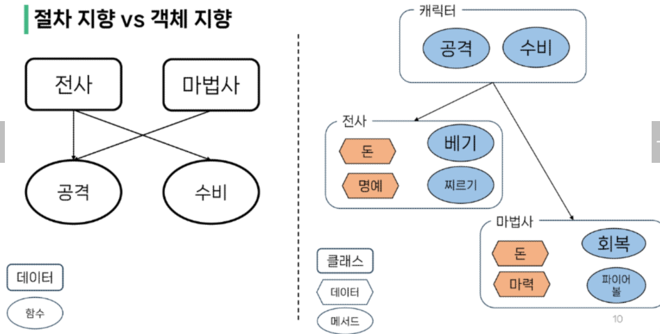
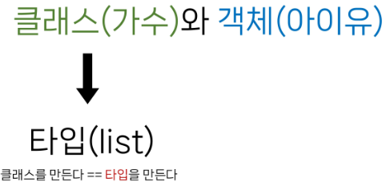
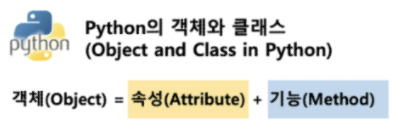

# Classes
- 객체 지향 프로그래밍
- 객체
- 클래스
- 메서드

---
# 객체 지향 프로그래밍

### 절차 지향 프로그래밍(Procedural Programming)
- 프로그램을 **'데이터'**와 **'절차'**로 구성하는 방식의 프로그래밍 패러다임
- 데이터와 절차를 독립적으로 생각함
- 패러다임(전반적인 프로그래밍 작성패턴 흐름)


#### 절차 지향 프로그래밍 특징
- "데이터"와 해당 데이터를 처리하는 **"함수(절차)"**가 분리되어 있으며, **함수 호출의 흐름**이 중요
- 코드의 순차적인 흐름과 함수 호출에 의해 프로그램이 진행
- 실제로 실행되는 내용이 무엇이 무엇인가가 중요
- 데이터를 다시 재사용하거나 하기보다는 **처음부터 끝까지 실행되는** 결과물이 중요한 방식


### 절차 vs 객체
- 절차
  - 먹는다(사람)
- 객체
  - 사람.먹는다()


#### 소프트웨어 위기(Software Crisis)
- 하드웨어의 발전으로 컴퓨터 계산용량과 문제의 복잡성이 급격히 증가함에 따라 소프트웨어에 발생한 충격

### 객체 지향 프로그래밍(Object Oriented Programming)
- 데이터와 해당 데이터를 조작하는 메서드(함수)를 **하나의 객체**로 묶어 관리하는 방식의 프로그래밍 패러다임
- 데이터 중심



| 절차 지향                                         | 객체 지향                                                    |
| ------------------------------------------------- | ------------------------------------------------------------ |
| 데이터와 해당 데이터를 처리하는 함수(절차)가 분리 | 데이터와 해당 **데이터를 처리하는 메서드(메시지)를 하나의 객체(클래스)로 묶음** |
| 함수 호출의 **흐름**이 중요                           | **객체 간 상호작용과 메시지 전달**이 중요                        |
| 함수 ( 데이터 ) - 데이터가 함수에 들어감 | 데이터(객체).메서드 - 데이터라는 주체가 메서드를 활용 |

### 객체지향의 장점
- 분류된 클래스들의 공통된 속성을 부모 클래스에 적어두면 따로 더 작성 할 필요 없음

---

## 클래스
- 파이썬에서 **타입**을 표현하는 방법
  - 객체를 생성하기 위한 **설계도**
  - 데이터와 기능(메서드)을 함께 묶는 방법을 제공
- 부모와 자식 클래스가 존재


예시
```py
name = 'harry'
# 'harry' 는 str 클래스의 인스턴스
```
### 객체(Object)
- 클래스에서 정의한 것을 토대로 메모리에 할당된 것
- **'속성'과 '행동'**으로 구성된 모든 것

### 객체 예시
 - 속성 (정보)
  - 직업 (가수)
  - 생년월일(1993.05.16)
  - 국적 (대한민국)

- 행동(메서드)
  - 랩( )
  - 댄스( )
  - 소몰이( )


### 클래스와 객체
- 가수(클래스)
- 객체 (아이유, BTS, ...)
- 클래스로 만든 객체를 **인스턴스** 라고 함
  - 예시
  - 아이유는 객체다 (O)
  - 아이유는 인스턴스다(X)
  - 아이유는 가수의 인스턴스다(O)
- 어디서 만들어진 인스턴스임을 명시해야함

- 클래스(가수)(=타입(list))와 객체(아이유)
- 클래스를 만든다 == 타입을 만든다



### 클래스와 객체
- 변수 name의 타입은 str 클래스다.
- 변수 name은 str 클래스의 인스턴스이다.
- 우리가 사용해왔던 데이터 타입은 사실 모두 클래스였다.
```python
name = 'Alice'
print (type (name))
# <class 'str'>
```
- 결국 문자열 타입의 변수는 str 클래스로 만든 인스턴스다.

## '','hello', '파이썬'
**문자열 타입(클래스)** 의 **객체(인스턴스)**

## [ 1, 2, 3 ], [ 1 ], [ ], [ ' hi ' ]
**리스트 타입(클래스)** 의 **객체(인스턴스)**

`'hello'.upper()`
- 문자열.대문자로()
- 객체.행동() - 객체가 중심임
- 인스턴스.메서드()

`[1,2,3].sort()`
- 리스트.정렬해()
- 객체.행동()
- 리스트라는 클래스의 인스턴스.메서드()


## 하나의 객체(object)는특정 타입의 인스턴스(instance)이다.
- 123, 900, 5는 모두 int의 인스턴스
- 'hello', 'bye'는 모두 string의 인스턴스 
- [232, 89, 1],[]은 모두 list의 인스턴스

#### 객체(object)의 특징
- 타입(type) : 어떤 연산자(operator)와 조작(method)이 가능한가?
  - 타입에 따라 사용할 수 있는 속성과 조작법이 다를 뿐
- 속성(attribute) : 어떤 상태(데이터)를 가지는가?
- 조작법(method) : 어떤 행위(함수)를 할 수 있는가?



## 파이썬에서의 객체는 속성과 기능이 결합한 결과
---
## 클래스
- 파이썬에서 타입을 표현하는 방법
  - 객체를 생성하기 위한 설계도
  - 데이터와 기능을 함께 묶는 방법을 제공

```py
# 클래스 정의
class Person:
    pass
# Person의 인스턴스(그동안 변수라고 부르던것) 생성
# 인스턴스 = 클래스()
iu = Person()
# 인스턴스 변수 설정
# 인스턴스.변수 = 값

# 메서드 호출
iu.메서드()

# 메서드와 속성은 자기를 만든 클래스안에 적혀있음

# 속성 (변수) 접근
iu.attribute

```
- 구조
- 클래스 이름 규칙 
    - 대문자로 시작, 언더바 대신 대문자로연결
```py
  class MyClass:
    # 속성(클래스 변수)

    # 메서드
    # 인스턴스 메서드 - 데코 x 인스턴스 자기자체가 인자로 들어와야함 self
    def instance_method(self):
        self.인스턴스변수
        # 인스턴스 자기자신을 조작하기 위해서
    
    # 클래스 메서드
    @classmethod
    def class_method(cls):
        cls.클래스변수
        cls.클래스메서드
        # 바로바로 클래스에 접근할 수 있기 위해

    # 스태틱 메서드 - 일반 함수(약속이 x)
    def static_method(a,b):
        return a + b
```

- 인스턴스 생성
    - `인스턴스 = 클래스()`
- 인스턴스 변수 설정
    - `인스턴스.변수 = 값`
- 인스턴스 메서드 사용
    - `인스턴스.인스턴스메서드()`


#### 클래스 기본 활용
```py
# 클래스 정의
class Person:
    # 속성(클래스 변수)
    blood_color = 'red'
    
    # 메서드
    # 매직메서드 - 개발자가 직접 호출 x
    # 생성자 메서드 -> __init__ (인스턴스를 만드려면 반드시 생성자 메서드 필요)
    def __init__(self,name):
        self.name = name

    def singing(self):
        return f'{self.name}가 노래합니다'

# 인스턴스 생성
singer1 = Person('iu') 
# name 이라는 인스턴스(위치인자)에 들어갈 인자 'iu'

# 인스턴스는 해당 클래스의 속성과 메서드 사용 가능
# 메서드 사용
print(singer1.singing())  # iu가 노래합니다

# 속성(변수) 접근
print (singer1.blood_color) # red

# 속성 값 변경
singer1.blood_color = 'blue'

print (singer1.blood_color) # blue
```


```py

class list:
    def append(self,arg)
a = [1,2,3]

a.append(4) # 축약형
list.append(a,4)
```


#### 생성자 함수
  - 객체를 생성할 때 자동으로 호출되는 특별한 메서드
  - __init__이라는 이름의 메서드로 정의되며, 객체의 **초기화**를 담당
  - 생성자 함수를 통해 인스턴스를 생성하고 필요한 초기값을 설정

```py
def __init__(self, name):
    # 인스턴스.인스턴스변수명(name) = 값(name)
    self.name = name

# 인스턴스 생성
singer1 = Person('iu')
```

#### 인스턴스 변수
- 인스턴스(객체)마다 별도로
유지되는 변수
- 인스턴스마다 독립적인 값을 가지며, 인스턴스가 생성될 때마다 초기화됨

```py
def __init__(self, name):
    self.name = name

# 인스턴스 변수
print(singer1.name) # iu
```

### 클래스 변수
- 클래스 내부에 선언된 변수
- 클래스로 생성된 모든 인스턴스들이
공유하는 변수
```py
class Person:
    blood color = 'red'

    
# 클래스 속성(변수) 점근
print(singer1.blood_color)
```

#### 인스턴스 메서드
- 각각의 인스턴스에서
호출할 수 있는 메서드
- 인스턴스 변수에 접근하고 수정하는 등의 작업을 수행

```py

def singing(self):
return f'{self.name}가 노래합니다.'

#인스턴스 메서드 호출
print (singer1.singing())
# iu가 노래합니다.
```


### 인스턴스와 클래스 간의 이름 공간(namespace)
- 클래스를 정의하면, 클래스와 해당하는 이름 공간 생성
- 인스턴스를 만들면, 인스턴스 객체가 생성되고 **독립적인** 이름 공간 생성
- 인스턴스에서 특정 속성에 접근하면, 인스턴스-> 클래스 순으로 탐색

#### 인스턴스와 클래스 간의 이름 공간(namespace)

```py
# Person 정의
class Person:
    name = 'unknown'
    # 인스턴스 메서드
    def talk(self):
        print (self.name)

p1 = Person()
p1.talk() # unknown
# P1은 인스턴스 변수가 정의되어 있지 않아 클래스 변수(unknown)가 출력됨

# p2 인스턴스 변수 설정 전/후
p2 = Person()
p2.talk() # unknown
p2.name = 'Kim' # 인스턴스 변수 설정하면
p2.talk() # Kim 본인의 인스턴스 변수 나옴
# p2는 인스턴스 변수가 정의되어 인스턴스 변수(Kim)가 출력됨

print(Person.name) # unknown
print (p1.name) # unknown
print (p2.name) # Kim
# Person 클래스의 값이 Kim으로 변경된 것이 아닌 p2 인스턴스의 이름 공간에 nameo Kim으로 저장됨
```


- 인스턴스 변수를 생성하면 


### 독립적인 이름공간을 가지는 이점
- 객체간의 독립성
  - 각 인스턴스는 독립적인 메모리 공간을 가지며, 클래스와 다른 인스턴스 간에는 서로의 데이터나 상태에 직접적인 접근이 불가능
- 객체 지향 프로그래밍의 중요한 특성 중 하나로, 클래스와 인스턴스를 모듈화하고 각각의 객체가 **독립적으로 동작**하도록 보장
- 이를 통해 클래스와 인스턴스는 다른 객체들과의 상호작용에서 **서로 충돌이나 영향을 주지 않으면서** 독립적으로 동작할 수 있음

-> 코드의 가독성, 유지보수성, 재사용성을 높이는데 도움을 줌

--- 
## 인스턴스 변수와 클래스 변수


#### 클래스 변수 활용
- 가수가 몇 명인지 확인하고 싶다면?
  - 인스턴스가 생성 될 때마다 클래스 변수가 늘어나도록 설정할 수 있음
```py
class Person:
    count = 0
    def __init__(self, name):
        # 모든 인스턴스는 기본적으로 name을 가지고 시작
        self.name = name
        Person.count += 1
        # 본인 클래스의 속성을 1을 늘림
        # 가수가 총 몇명이 생성되었는지 확인하고 싶을때
person1 = Person('iu')
person2 = Person ('BTS')

print (Person.count) # 2
```
#### 클래스 변수와 인스턴스 변수
- 클래스 변수를 변경할 때는 항상 **클래스.클래스변수** 형식으로 변경

```py
class Circle:
    # pi의 값은 고정이라 클래스 변수로 지정
    pi = 3.14
    def __init__(self, r):
        # 반지름의 값은 모두 다를테니 인스턴수로 받음
        self.r = r
c1 = Circle(5)
c2 = Circle (10)

# 가장 바람직한 사용법은 -> 클래스.클래스변수
# 하지만 인스턴스도 공유되는 데이터이기 때문에 접근 가능 -> 인스턴스.클래스변수

print(Circle.pi) # 3.14
print(c1.pi) # 3.14
print(c2.pi) # 3.14


# 클래스변수를 바꿀땐 클래스에서 접근하여 가능
Circle.pi=5 # 클래스 변수 변경

print(Circle.pi) # 5
print(c1.pi) # 5
print(c2.pi) # 5


c2.pi= 5 # 클래스 변수가 바뀐게 아님

# 접근은 가능하나 클래스 변수의 값은 변경할 수 없음
# c2.pi = 99 -> c2가 가지는 공간에 pi 라는 인스턴스를 새로 생성한 것이나 마찬가지

# 인스턴스 변수를 변경
print(Circle.pi) # 3.14 (클래스 변수)
print(c1.pi) # 3.14
print(c2.pi) # 5 (새로운 인스턴스 변수가 생성됨)

```

---
## 메서드
- 인스턴스 메서드 (현재까지 쓰던거)
- 클래스 메서드
- 정적 메서드


### 인스턴스 메서드(instance method)
- 클래스로부터 생성된 각 인스턴스에서 호출할 수 있는 메서드

- 인스턴스의 상태를 조작하거나 동작을 수행

### 인스턴스 메서드 구조
- 클래스 내부에 정의되는 메서드의 기본
- 반드시 첫 번째 매개변수로 **인스턴스 자신(self)**을 전달받음

```py
class MyClass:

    def instance_method(self, arg1, ...):
      pass
```


#### self 동작 원리
- upper 메서드를 사용해 문자열 'hello'를 대문자로 변경하기
```py
'hello'.upper()
```
- 하지만 실제 파이썬 내부 동작은 다음과 같이 이루어진다.
```py
str.upper('hello')
```  
- str 클래스가 upper 메서드를 호출했고, 그 첫번째 인자로 문자열 인스턴스가 들어간 것이다.

### 인스턴스 메서드의 첫번째 매개변수가 반드시 인스턴스 자기 자신인 이유


- `'hello'.upper()`은 `str.upper('hello')` 를 객체 지향 방식의 메서드로 호출하는 표현이다. (단축형 호출)

- 'hello'라는 문자열 객체가 단순히 어딘가의 함수로 들어가는 인자가 아닌
**객체 스스로 메서드를 호출**하여 코드를 동작하는 **객체 지향적 표현**이다.

### 생성자 메서드(constructor method)
인스턴스 객체가 생성될 때 자동으로 호출되는 메서드

-> 인스턴스 변수들의 초기값을 설정
```py
# 객체가 인스턴스가 메서드를 호출하는 방법

# 1. 인스턴스.메서드()
'abc'.upper()
# 객체 지향 (데이터가 무엇을 함)

# 2. 클래스.메서드(인스턴스 자기자신)
str.upper('abc')
# 객체 지향 x (데이터가 인자로 들어감)


```
### 생성자 메서드 구조
```py
class Person:
    def __init__(self)
        print('인스턴스가 생성되었습니다. ')
person1 = Person()  # 인스턴스가 생성되었습니다.

def __init__(self, name):
print (f'인스턴스가 생성되었습니다. {name}')
person1 = Person('지민') # 인스턴스가 생성되었습니다. 지민
```
### 클래스 메서드(class method)
- 클래스가 호출하는 메서드

-> 클래스 변수를 조작하거나 클```래스 레벨의 동작을 수행

### 클래스 메서드 구조 
- `@classmethod` 데코레이터를 사용하여 정의

- 호출 시, 첫번째 인자로 호출하는 클래스(cls)가 전달됨
``` py
class MyClass:

    @classmethod
    def class _method(cls, arg1, ...):
        pass
    # 클래스 자기자신이 첫번째 인자로 들어감

```
### 클래스 메서드 예시
```py
class Person:
    count = 0
    def __init__(self, nane):
        self.name = nane
        Person.count += 1

    @classmethod
    def number.of_population(cls):
        print (f'인구수는 {cls.count}입니다')
person1 = Person('iu')
person2 = Person ('BTS')
Person. number_of_population() # 인구수는 2입니다.
```
---

## 스태틱(정적) 메서드
static method
- 클래스와 인스턴스와 상관없이 독립적으로 동작하는 메서드

- 주로 클래스와 관련이 있지만 인스턴스와 상호작용이
필요하지 않은 경우에 사용

### 스태딕 메서드 구조
- `@staticmethod` 데코레이터를 사용하여 정의
- 호출 시 필수적으로 작성해야 할 매개변수가 없음
- 즉, 객체 상태나 클래스 상태를 수정할 수 없으며 단지 기능(행동)만을 위한 메서드로 사용
```py  
class MyClass:
    @staticmethod
    def static_method (arg1, ...):
        pass
```
- 스태딕 메서드 예시

```py
class StringUtils:
    @staticmethod 
    def reverse_string(string):
        return string[::-1]
    @staticmethod
    def capitalize_string (string) :
        return string.capitalize()

text = 'hello, world'

reversed_text = StringUtils.reverse_string(text)
print(reversed_text) # drow ,olleh
capitalized_text = StringUtils. capitalize_string(text)
print(capitalized_text) # Hello, world
```

### 메서드 정리
- 인스턴스 메서드
  - 인스턴스의 상태를 변경하거나, 해당 인스턴스의 특정 동작을 수행
  - self
- 클래스 메서드
  - 인스턴스의 상태에 의존하지 않는 기능을 정의
  - 클래스 변수를 조작하거나 클래스 레벨의 동작을 수행
  - 함수내에서 cls로 바로 접근
- 스태틱 매서드
  - 클래스 및 인스턴스와 관련이 없는 일반적인 기능을 수행
  - 클래스가 사용

### 각자의 역할
- 클래스가 사용해야 할 것
  - 클래스 메서드
  - 스태틱 메서드
- 인스턴스가 사용해야 할 것
  - 인스턴스 메서드
```py
class MyClass:
    # 데코레이션이 안붙음 인스턴스를 호출하는 self 인자
    def instance_method (self):
        return "Instance method", self
    # 데코레이션이 붙고 클래스 본인을 호출하는
    # cls 인자를 받음
    @classmethod
    def class_method (cls):
        return "class method", cls
    # 데코레이션 붙고 인자는 자유롭게 받음
    @staticmethod 
    def static_method():
        return "static method"
```

### 클래스가 할 수 있는 것
- 클래스는 모든 메서드를 호출 할 수 있음
- **하지만 클래스는 클래스 메서드와 스태틱 메서드만 사용하도록 한다**

```py
instance = MyClass()

print(MyClass.instance_method(instance)) # ('instance method", <-main. MyClass object atox..028F10> 
print(MyClass.class_method()) # ('class method', <class main__.MyClass'>) 
print (MyClass.static_method()) # static_method
```


### 인스턴스가 할 수 있는 것
- 인스턴스는 모든 메서드를 호출 할 수 있음
- **하지만 인스턴스는 인스턴스 메서드만 사용하도록 한다**

```py
instance = MyClass()
print(instance.instance_method()) 
# ('instance method', <main. Myclass object at 0x0000.84E 
print (instance.class_method0()) 
# ('class method", <class _main__«MyClass'>) 
print (instance.static_method()) 
# static method
```
## 할 수 있다 != 써도 된다
- 각자의 메서드는 OOP 패러다임에 따라 명확한 목적에 따라 설계된 것이기 때문에
클래스와 인스턴스 각각올바른 메서드만 사용하도록 해야 한다.


### 매직 메서드
- 특별한 인스턴스 메서드
- 특정 상황에 **자동으로 호출**되는 메서드
- Double underscore()가 있는 메서드는 특수한 동작을 위해 만들어진 메서드
. 스페셜 메서드 혹은 매직 메서드라고 불림
- 예시
- `__str__(self), __Len__ (self), __It__ (self, other), __le__ (self, other), __eq__(self, other), __gt__ (self, other), __ge__(self, other), __ne__(self, other)`

### 매직 메서드 예시

```py
class Circle:
    def __init__(self, r):
        self.r = r
    def area(self):
        return 3.14 * self.r * self.r

    # __str__ 사용되기 전
    #  <__main__.Circle object at 0x000001CE6D2F3E80>
    # <__main__.Circle object at 0x000001CE6D2F3DC0>

    def __str__(self):
        return f'[원] radius: {self.r}'

c1 = Circle(10)
c2 = Circle(1)


print(c1) # [원] radius: 10
print(c2) # [원] radius: 1
```
### 데코레이터 (Decorator)
- 다른 함수의 코드를 유지한 채로 수정하거나 확장하기 위해 사용되는 함수

데코레이터 정의
```py
def my_decorator (func) :
    def wrapper:
        # 함수 실행 전에 수행할 작업
        print ('함수 실행 전')

        # 원본 함수 호출
        result = func()

        # 함수 실행 후에 수행할 작업
        print('함수 실행 후')
    return result 
return wrapper
```
데코레이터 적용
```py
@my_decorator 
def my_function():
    print(' 원본 함수 실행')

my_function()
"""
함수 실행 전
원본 함수 실행
함수 실행 후
"""
```
## 절차 지향과 객체 지향은 대조되는 개념이 아니다
- 객체 지향은 기존 절차 지향을 기반으로 두고 보완하기 위해 객체라는 개념을 도입해 상속, 코드 재사용성, 유지보수성 등의 이점을 가지는 패러다임