# 트리 (Tree)
- 트리
- 이진 트리
- 이진 트리의 표현
- [참고] 이진 트리의 저장
- 연습 문제
- 이진탐색 트리
- 힙
  
## 트리의 개념
- 비선형 구조
- 원소들 간에 1m 관계를 가지는 자료구조
- 원소들 간에 계층관계를 가지는 계층형 자료구조
- 상위 원소에서 하위 원소로 내려가면서 확장되는 트리(나무)모양의 구조
## 트리의 정의
- 한 개 이상의 노드로 이루어진 유한 집합이며 다음 조건을 만족한다.
- 노드 중 최상위 노드를 루트(Root)라 한다.
- 나머지 노드들은 n(>= 0)개의 분리 집합 T1,..,TN으로 분리될 수 있다.
- 이들 T1,...,TN은 각각 하나의 트리가 되며(재귀적 정의) 루트의 부 트리(subtree)라 한다.
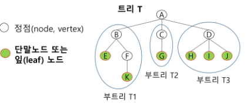
- 노드(node) - 트리의 원소
  - 트리 T의 노드 - A, B, C, D, E, F, G, H, I, J, K
- 간선(edge) - 노드를 연결하는 선. 부모 노드와 자식 노드를 연결
- 루트 노드(root node)- 트리의 시작 노드
- 트리 T의 루트노드 : A

## 트리의 용어정리
- 형제 노드(sibling node) - 같은 부모 노드의 자식 노드들
  - B, C, D는 형제 노드
- 조상 노드- 간선을 따라 루트 노드까지 이르는 경로에 있는 모든 노드들
  - K의 조상 노드: F, B, A
- 서브 트리(subtree) - 부모 노드와 연결된 간선을 끊었을 때 생성되는 트리
- 자손 노드 - 서브 트리에 있는 하위 레벨의 노드들
  - B의 자손 노드- E, F, X

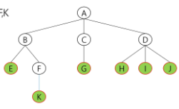

### 차수(degree)

>- 노드의 차수 : 노드에 연결된 자식 노드의 수
>   - B의 차수 = 2 C의 차수 = 1
>- 트리의 차수: 트리에 있는 노드의 차수 중에서 가장 큰 값
>   - 트리 T의 차수 = 3
>- 단말 노드(리프 노드) : 차수가 0인 노드 자식 노드가 없는 노드

### 높이
- 노드의 높이: 루트에서 노드에 이르는 간선의 수.노드의 레벨
  - B의 높이 = 1, F의 높이 = 2 
- 트리의 높이 : 트리에 있는 노드의 높이 중에서 가장 큰 값, 최대 레벨
  - 트리 T의 높이=3
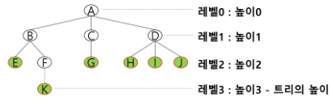
---
# 이진트리
- 모든 노드들이 2개의 서브트리를 갖는 특별한 형태의 트리
- 각 노드가 자식 노드를 **최대 2개 까지**(2개 이하도 가능)만 가질 수 있는 트리
  - 왼쪽 자식 노드(left child node)
  - 오른쪽 자식 노드(right child node)
- 이진 트리의 예
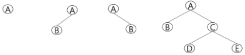

## 이진트리 특성
- 레벨 1에서의 노드의 최대 개수는 2개
- 높이가 h인 이진 트리가 가질 수 있는 노드의 최소 개수는 (h+1)개가 되며, 최대 개수는 (2^(h+1)-1)개가 된다.
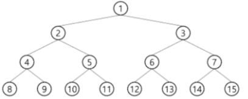

## 이진트리 종류
### 포화 이진 트리(Full Binary Tree)
  - 모든 레벨에 노드가 포화상태로 차 있는 이진 트리
  - 높이가 h일 때, 최대의 노드 개수인 2^(h+1)-1 의 노드를 가진 이진 트리
    - 높이 3일 때 2^(3+1)-1 = 15개의 노드
  - **루트를 1번**으로 하여 2^(h+1)-1 까지 정해진 위치에 대한 노드 번호를 가짐
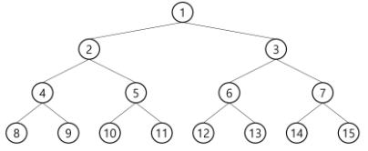

### 완전 이진 트리(Complete Binary Tree)
- 높이가 h이고 노드 수가 n개일 때 (단, 2^h <= n <= 2^(h+1)-1 ), 포화 이진 트리의 노드 번호 1번부터
n번까지 **빈 자리가 없는 이진 트리**
- (예) 노드가 10개인 완전 이진 트리
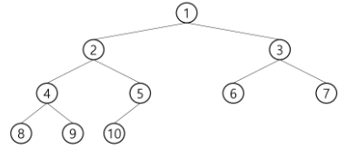

### 편향 이진 트리(Skewed Binary Tree)
- 높이 h에 대한 최소 개수의 노드를 가지면서 한쪽 방향의 자식 노드만을 가진 이진 트리
- 트리의 장점이 없음..

  - 왼쪽 편향 이진 트리
  - 오른쪽 편향 이진 트리
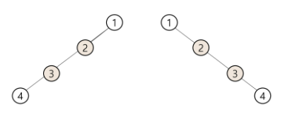

## 이진트리 - 순회
- 순회(traversal)란 트리의 각 노드를 중복되지 않게 전부 방문(visit) 하는 것을 말하는데 트리는 비 선형 구조이기 때문에 선형구조에서와 같이 선후 연결
관계를 알 수 없다.

### 순회(traversal)
- 트리의 노드들을 체계적으로 방문하는 것
- 3가지의 기본적인 순회방법
- **전위순회**(preorder traversal): VLR
  - 부모노드 방문 & 처리 후, 자식노드를 좌,우 순서로 방문 & 처리한다.
- **중위순회**(inorder traversal) : LVR
  - 왼쪽 자식노드 , 부모노드, 오른쪽 자식노드 순으로 방문 & 처리한다.
- **후위순회**(postorder traversal) : LPV
  - 자식노드를 좌우 순서로 방문 & 처리 한 후, 부모노드로 방문 & 처리한다.

### 전위 순회(preorder traversal)
- 수행 방법
1. 현재 노드 m을 방문하여 처리한다. -> V
2. 현재 노드 n의 왼쪽 서브트리로 이동한다.-> L
3. 현재 노드 n의 오른쪽 서브트리로 이동한다.-> R
- 전위 순회 알고리즘
```
def preorder_traverse(T) :  # 전위순회
  if T:                     # T is not None
    visit(T)                # print (T.item)
    preorder_traverse (T.left)
    preorder_traverse (T.right)
```
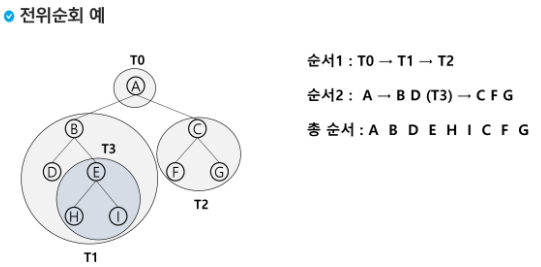
### 중위 순회(inorder traversal)
- 수행 방법
1. 현재 노드 n의 왼쪽 서브트리로 이동한다 : L
2. 현재 노드 m을 방문하여 처리한다: V
3. 현재 노드 n의 오른쪽 서브트리로 이동하다 : R
- 중위 순회 알고리즘
```
def inorder_traverse (T) :  # 중위순회
  if T:                     # T is not None
    inorder traverse(T.left)
    visit (T)               # print(T.item)
    inorder_traverse (T.right)
```
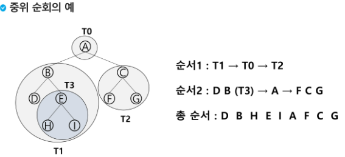

### 후위 순회(postorder traversal)
- 수행 방법
- 부모를 가장 마지막에 검사
1. 현재 노드 n의 왼쪽 서브트리로 이동한다.: L
2. 현재 노드 n의 오른쪽 서브트리로 이동한다.: R
3. 현재 노드 n을 방문하여 처리한다.: V
- 후위 순회 알고리즘
```
def postorder traverse(T):  # 후위순회
  if T:   # T is not None
    postorder_traverse(T.left)
    postorder_traverse (T.right)
    visit(T)    # print(T.itrm)
```
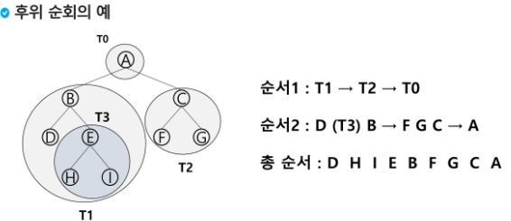

- 이진 트리의 순회
  - 전위 순회는 ?   ->  A B D E C F G
  - 중위 순회는 ?   ->  D B E A F C G
  - 후위 순회는 ?   ->  D E B F G C A

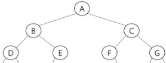

### 전위순회는 루트가 가장 앞에 오고 후위순회는 루트가 가장 뒤에 옴
---
# 이진트리의 표현
- 배열을 이용한 이진 트리의 표현
  - 이진 트리에 각 노드 번호를 다음과 같이 부여
  - 루트의 번호를 1로 함
  - 레벨 n에 있는 노드에 대하여 왼쪽부터 오른쪽으로 2^n 부터 2^(n+1)-1 까지 번호를 차례로 부여
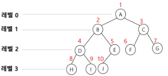

- 배열을 이용한 이진 트리의 표현
- 노드 번호의 성질
  - 노드 번호가 i인 노드의 부모 노드번호? `i//2`
  - 노드 번호가 i인 노드의 왼쪽 자식 노드 번호? `2*i`
  - 노드 번호가 i 인 노드의 오른쪽 자식 노드 번호? `2*i+1`
  - 레벨 n의 노드 번호 시작 번호는? `2^n`

### 배열을 이용한 이진 트리의 표현
- 노드 번호를 배열의 인덱스로 사용
- 높이가 h 인 이진 트리를 위한 배열의 크기는?

  - 레벨 1의 최대 노드 수는? 2^i
  - 따라서 1+ 2+ 4+ 8.. + 2^i = 2^(h+1)-1

---
## [참고] 이진트리의 저장
- 부모 번호를 인덱스로 자식 번호를 저장
  + 인접 리스트로 사용하는 것도 같은 의미? 
  + 2차원 배열필요
```
for i: 1-> N
  read p,c
  if (c1[p] == 0)
    c1[p] = c
  else
    c2[p] = c
```
- 자식 번호를 인덱스로 부모 번호를 저장
  - 루트 찾기, 조상 찾기
  - 1차원 배열만 있으면 됨
```
c = 5
while (a[c] != 0)
  c = a[c]
  and.append(c)
root = c
```

### 배열을 이용한 이진 트리의 표현의 단점
- 편향 이진 트리의 경우에 사용하지 않는 배열 원소에 대한 메모리 공간 낭비 발생
- 트리의 중간에 새로운 노드를 삽입하거나 기존의 노드를 삭제할 경우 배열의 크기 변경 어려워 비효율적

## 트리의 표현 - 연결리스트
- 배열을 이용한 이진 트리의 표현의 단점을 보완하기 위해 연결리스트를 이용하여 트리를 표현할 수 있다.
- 연결 자료구조를 이용한 이진트리의 표현
  - 이진 트리의 모든 노드는 최대 2개의 자식 노드를 가지므로 일정한 구조의 단순 연결 리스트
노드를 사용하여 구현

- 완전 이진 트리의 연결 리스트 표현

---
## 연습문제
- 첫 줄에는 트리의 정점의 총 수 V가 주어진다. 그 다음 줄에는 V-1개 간선이 나열된다. 간선은 그것을 이루는 두 정점으로 표기된다. 간선은 항상 "부모 자식" 순서로 표기된다. 아래 예에서 두 번째 줄 처음 1과 2는 정점 1과 2를 잇는 간선을 의미하며 10 부모, 2가 자식을 의미한다. 간선은 부모 정점 번호가 작은 것부터 나열되고, 부모 정점이 동일하다면 자식 정점 번호가 작은 것부터 나열된다.
- 다음 이진 트리 표현에 대하여 전위 순회하여 정점의 번호를 출력하시오.
  - 13 <- 정점의 개수
  - 1 2 1 3 2 4 3 5 3 6 4 7 5 8 5 9 6 10 6 11 7 12 11 13

```
"""
13
1 2 1 3 2 4 3 5 3 6 4 7 5 8 5 9 6 10 6 11 7 12 11 13
"""
# 전위순회 함수
def preorder(n):
    if n:       # 존재하는 정점이면
        print(n, end=' ')            # visit(n)
        preorder(ch1[n])          # 왼쪽 서브트리로 이동
        preorder(ch2[n])          # 오른쪽 서브트리로 이동


V = int(input())        # 정점수, 마지막 정점 번호
E = V - 1               # tree의 간선 수 = 정점 수 - 1
arr = list(map(int,input().split()))
# 부모를 인덱스로 자식을 저장
ch1 = [0] * (V+1)
ch2 = [0] * (V+1)
# 자식을 인덱스로 부모를 저장
par = [0] * (V+1)
for i in range(E):
    a = arr[2*i]
    b = arr[2*i+1]
    if ch1[a] == 0:     # 자식 1이 아직 없으면
        ch1[a] = b
    else:
        ch2[a] = b
    par[b] = a          # 자식 인덱스에 부모 저장

# 실제 루트 찾기
root = 1
while par[root] != 0:
    root += 1
preorder(root)
```


---
# 기욱신 필기
## Tree 순회 방법
### 1. pre_order (전위)
- 처음 지나갈때 방문
- 자식노드를 좌, 우 순서로 방문
### 2. In_order (중위)
- 왼쪽에서 돌아올때 방문한다
- 왼쪽노드 방문
- 부모노드 방문
- 오른쪽 자식 방문
### 3. Post_order (후위)
- 오른쪽에서 돌아오면서 방문한다.
- 자식노드를 좌우로 방문하고 부모노드를 방문한다.


### 전위 순회
> 루트 노드를 가장 먼저 방문하기 때문에 트리의 구조를 파악하기 쉬움
- 트리의 레이아웃 파악 -> 복사, 트리의 균형 파악

### 중위 순회
> 이진트리에 많이 활용이 된다.
> 이진트리는 왼쪽자식노드의 크기가 나보다 작고 오른쪽 자식 노드의 크기가 나보다 크다.
- 이진트리의 값들을 정렬된 순서로 받아올 수 있다.
- 빠른 검색 : 정렬되었기 때문에 빠르게 검색할 수 있다.
- 정렬되지 않은 데이터를 가지고 이진트리를 구성하면 정렬된 효과를 얻을 수 있다.

### 후위 순회
> 리프노드에서부터 탐색을 시작하는 특징
- 삭제와 삽입
- 노드의 삭제와 삽입을 할 경우, 자식 노드부터 처리할 수 있다.
  

## 트리 vs 그래프
### 그래프
- 정의 : 노드의 간선으로 구성되는 자료구조
- 방향성 : 방향 그래프 O, 무방향 그래프 O
- 루트 노드 : X
- 부모 / 자식 관계 : X

# 트리
- 정의 : 그래프의 한 종류, 방향성이 있는 비순환 그래프
- 방향성 : 방향 그래프 O, 무방향 그래프 X
- 루트노드 : O
- 부모/자식 관계 : O


---

## 수식트리
- 수식을 표현하는 이진 트리
- 수식 이진 트리(Expression Binary Tree)라고 부르기도 함.
- 연산자는 루트 노드이거나 가지 노드
- 피연산자는 모두 잎 노드
## 수식트리의 순회
- 중위 순회 : A / B* C D + E (식의 중위 표기법)
- 후위 순회 : A B / C D * E + (식의 후위 표기법)
- 전위 순회 : + * * / A B C D E (식의 전위 표기법)
> 구현 X

---
# 이진 탐색 트리
- 탐색작업을 효율적으로 하기 위한 자료구조
- 모든 원소는 서로 다른 유일한 키를 갖는다.
- key(왼쪽 서브트리) < key(루트 노드) < key(오른쪽 서브트리)
- 왼쪽 서브트리와 오른쪽 서브트리도 이진 탐색 트리다.
- 중위 순회하면 오름차순으로 정렬된 값을 얻을 수 있다.
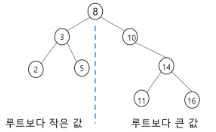
## 이진 탐색 트리 - 연산
- 탐색연산
  - 루트에서 시작한다.
  - 탐색할 키 값 X를 루트 노드의 키 값과 비교한다.
    - (키 값 X = 루트노드의 키 값)인 경우 : 원하는 원소를 찾았으므로 탐색연산 성공
    - (키 값 x < 루트노드의 키 값)인 경우 : 루트노드의 왼쪽 서브트리에 대해서 탐색연산 수행
    - (키 값 x > 루트노드의 키 값)인 경우 : 루트노드의 오른쪽 서브트리에 대해서 탐색연산 수행
    - 서브트리에 대해서 순환적으로 탐색 연산을 반복한다.

## 탐색연산
- 13 탐색
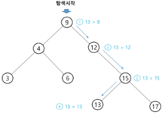
1. 루트 9 보다 큼 -> 오른쪽
2. 서브트리 12 보다 큼 -> 오른쪽
3. 서브트리 15보다 작음 -> 왼쪽
4. 리프트리 13 찾음

## 삽입 연산
1. 먼저 탐색 연산을 수행
- 삽입할 원소와 같은 원소가 트리에 있으면 삽입할 수 없으므로, 같은 원소가 트리에 있는지 탐색하여 확인한다.
- 탐색에서 탐색 실패가 결정되는 위치가 삽입 위치가 된다.
2. 탐색 실패한 위치에 원소를 삽입한다.
- 다음 예는 5을 삽입하는 예이다
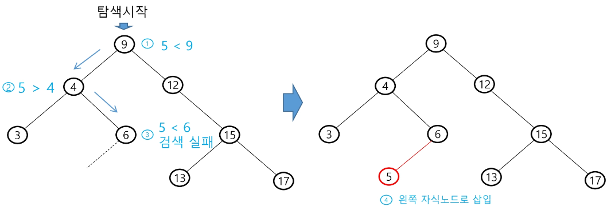


## 이진 탐색 트리 - 성능
- 탐색(searching), 삽입(insertion), 삭제(deletion) 시간은 트리의 높이 만큼 시간이 걸린다.
  - O(h), h : BST의 깊이(height)
- 평균의 경우
  - 이진 트리가 균형적으로 생성되어 있는 경우
  - O(log n)
- 최악의 경우
  - 한쪽으로 치우친 경사 이진트리의 경우
  - O(n)
  - 순차탐색과 시간복잡도가 같다.

- 검색 알고리즘의 비교
  - 배열에서의 순차 검색 : O(N)
  - 정렬된 배열에서의 순차 검색 : O(N)
  - 정렬된 배열에서의 이진탐색 : O(log N)

    - 고정 배열 크기와 삽입, 삭제 시 추가 연산 필요
  - 이진 탐색트리에서의 평균 : O(log N)
    - 최악의 경우: O(N)
    - 완전 이진 트리 또는 균형트리로 바꿀 수 있다면 최악의 경우를 없앨 수 있다.
    - 새로운 원소를 삽입할 때 삽입 시간을 줄인다.
    - 평균과 최악의 시간이 같다. O(log n)
  - 해쉬 검색 : O(1)
    - 추가 저장 공간이 필요


## 이진 탐색 트리- 연산 연습
- 삭제 연산
  - 삭제연산에 대해 알고리즘을 생각해 봅시다.
  - 다음 트리에 대하여 13, 12, 9를 차례로 삭제해 보자.
> 오른쪽에서 삭제할 때 
> 루트를 삭제하고 오른쪽 서브트리의 가장 작은 값을 루트로 두기..?


## 참고 힙(heap)
- **완전 이진 트리**에 있는 노드 중에서 키값이 가장 큰 노드나 키값이 가장 작은
노드를 찾기 위해서 만든 자료구조
### 최대 힙(max heap)
- 키값이 가장 큰 노드를 찾기 위한 완전 이진 트리
- 부모노드의 키값 > 자식노드의 키값
- **루트 노드: 키값이 가장 큰 노트**
### 최소 힙(min heap)
- 키값이 가장 작은 노드를 찾기 위한 완전 이진 트리
- {부모노드의 키값 > 자식노드의 키리}
- **루트 노드: 키값이 가장 작은 노드**
- 힙에서는 루트 노드의 원소만을 삭제 할 수 있다.
- 루트 노드의 원소를 삭제하여 반환한다.
- 힙의 종류에 따라 최대값 또는 최소값을 구할 수 있다.
- 힙의 예
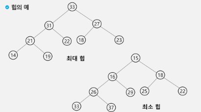
## 힙연산 - 삽입
1. 마지막 노드에 삽입
2. 부모와 비교해서 부모보다 크면 자리 바꿈
3. 정렬될 때 까지 계속 진행

### (예) 17 삽입
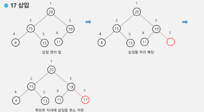
### (예) 23 삽입
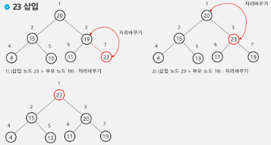
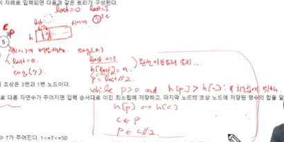

## 힙연산 - 삭제
- 힙에서는 루트 노드의 원소만을 삭제 할 수 있다
- 루트 노드의 원소를 삭제하여 반환한다
- 힙의 종류에 따라 최대값 또는 최소값을 구할 수 있다

1. 루트노드의 원소 삭제
2. 마지막 노드 의 값을 부모에 가져다 놓기
3. 자식이 없거나 부모다 더 클때까지 더 큰 자식노드와 자리 바꾸기


- 힙의 키를 우선순위로 활용하여 우선순위 큐를 구현할 수 있다.


