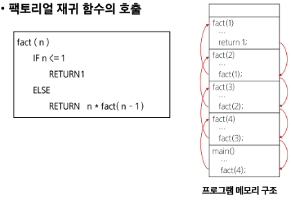
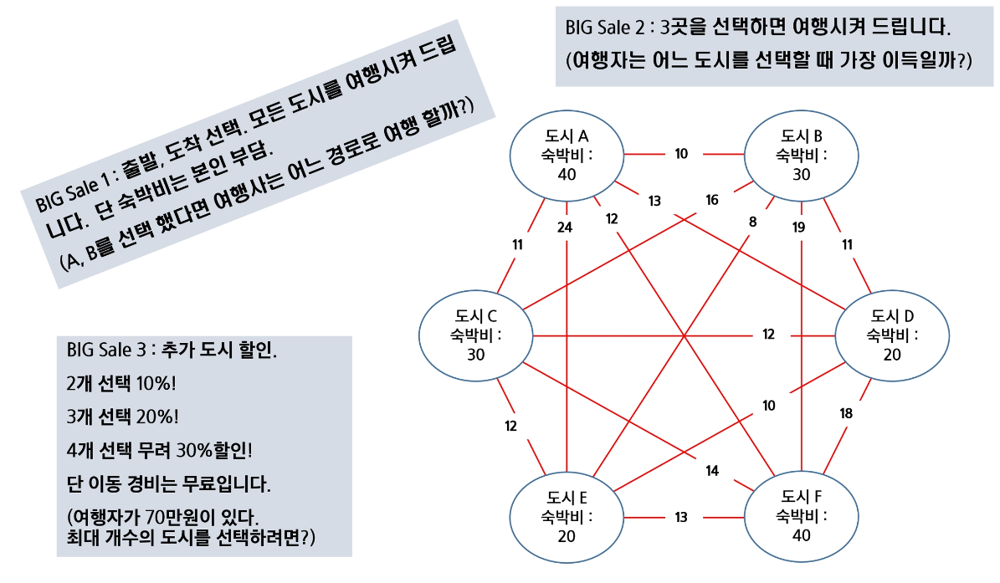
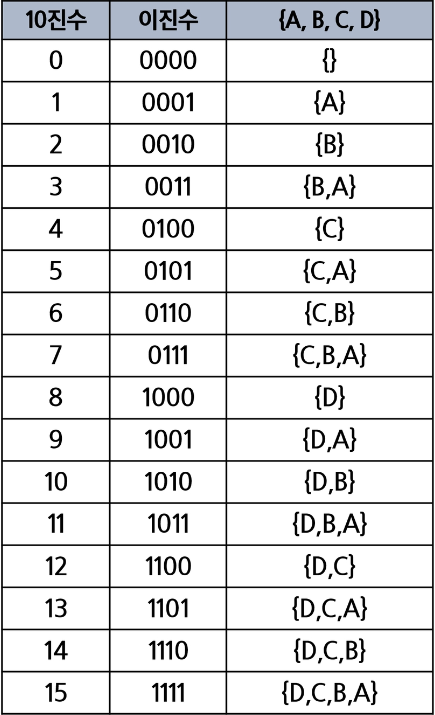

# 완전검색 & 그리디
- 반복(Iteration)과 재귀(Recursion)
- 완전검색기법
- 순열
- 부분 집합
- 조합
- 탐욕 알고리즘
- 활동 선택 문제
- Baby-jin

## 반복(Iteration)과 재귀(Recursion)
- 반복과 재귀는 유사한 작업을 수행할 수 있다.
- 반복은 수행하는 작업이 완료될 때 까지 계속 반복
- 루프 (for, while 구조)
- 재귀는 주어진 문제의 해를 구하기 위해 동일하면서 더 작은 문제의
를 이용하는 방법
  - 하나의 큰 문제를 해결할 수 있는 (해결하기 쉬운) 더 작은 문제로 쪼개고 결고
  을 결합한다.
  - 재귀 함수로 구현


### 반복구조
- 초기화
  - 반복되는 명령문을 실행하기 전에 (한번만) 조건 검사에 사용할 변수의 초기값 설정
- 조건검사 (check control expression)
- 반복할 명령문 실행 (action )
- 업데이트 (loop update)
  - 무한 루프(infinite loop)가 되지 않 게 조건이 거짓(false)이 되게 한다.

- 반복을 이용한 선택정렬

```py
def SelectionSort(A):
  n = len (A)
  for i in range(0, n-1):
    minI = i
    for j in range(i+1, n)
      if A[j] < A[miniI]:
        minI = j
    A[minI], A[i] - A[i], A[minI]
```

### 재귀적 알고리즘
- 재귀적 정의는 두 부분으로 나뉜다.
- 하나 또는 그 이상의 기본 경우(basis case or rile)

  - 집합에 포함되어 있는 원소로 induction 생성하기 위한 시드(seed) 역할
- 하나 또는 그 이상의 유도된 경우(inductive case or rule)
  -  새로운 집합의 원소를 생성하기 위해 결합되어지는 방법

---
# 재귀 함수 (recursive function)
- 함수 내부에서 직접 혹은 간접적으로 자기 자신을 호출하는 함수.
- 일반적으로 재귀적 정의를 이용해서 재귀 함수를 구현한다.
- 따라서, **기본 부분**(basis part)와 **유도 부분**(inductive part)로 구성된다.
- 재귀적 프로그램을 작성하는 것은 반복 구조에 비해 간결하고 이해하기 쉽다.
  - 그러나, 재귀에 대해 익숙하지 않은 개발자들은 재귀적 프로그램이 어렵다고 느낀다.
- 함수 호출은 프로그램 메모리 구조에서 스택을 사용한다. 따라서 재귀 호출은 반복적인 스택의 사용을 의미하며 메모리 및 속도에서 성능저하가 발생한다.


## 팩토리얼 재귀 함수
- 재귀적 정의
  - Basis rule:
    - N<=1 경우, n=1
  - Inductive rule:
    - N> 1, n! = n * (n - 1)!
- n! 에 대한 재귀함수
```py
def fact(n):
if n <= 1:
  return 1      # Basis part
else:
  return n * fact(n - 1)    # Inductive part
```



## 기본 재귀 형태
```py
# A를 B로 복사하고 완성되면 출력하는 함수
def f(i,N):     # i 현재상태, N 목표
    if i == N:  # 현재상태 == 목표 -> 끝
        print(B)    # 모두 다 수행하고 나서 복사한 B를 출력
        return
    else:
        B[i] = A[i]     # B[i]에 A[i]를 복사함
        f(i+1,N)

N = 5
A = [1,2,3,4,5]
B = [0] * N
f(0,N)
```

```py
# key가 있으면 1, 없으면 0을 리턴하는 함수
def f(i,N,key,arr):     # i 현재상태, N 목표, key 찾고자 하는 원소
    if i == N:  # 현재상태 == 목표 -> 끝
        return 0  # 끝까지 도달했으면 키가 없는 경우
    elif arr[i] == key:  # key를 찾은경우 
        return 1    # 1을 찾음
    else:
        return f(i+1,N,key,arr)

N = 5
A = [1,2,3,4,5]
B = [0] * N
key = 4
print(f(0,N,key,A))
```

- 해결할 문제를 고려해서 반복이나 재귀의 방법을 선택
- 재귀는 문제 해결을 위한 알고리즘 설계가 간단하고 자연스럽다.
  - 추상 자료형(List, tree 등)의 알고리즘은 재귀적 구현이 간단하고 자연스러운 경우가 많다.
- 일반적으로, 재귀적 알고리즘은 반복(Iterative) 알고리즘보다 더 많은 메모리와 연산을 필요로 한다.
## 주의
- 입력 값 n이 커질수록 재귀 알고리즘은 반복에 비해 비효율적일 수 있다
- 슬라이싱한 배열을 넘기지 말것... 메모리 많이 잡아먹음 그냥 인덱스로 접근


| | 재귀 | 반복 |
|-|-|-|
| 종료 |재귀 향수 호출이 종료되는 베이스 케이스(base case)| 반복문의 종료조건|
|수행시간|(상대적)느림 | 빠름|
|메모리 공간 |(상대적)많이 사용|적게 사용|
|소스코드 길이| 짧고 간결 | 길다|
|소스코드 형태 | 선택구조(if-else) | 반복구조(for,while)|
|무한반복시 | 스택오버플로우|CPU를 반복해서 점유|

---
# Baby-gin Game
- 카드 여섯장을 뽑음
- 세장이 연속한 번호일때 run
- 세장이 같은 번호일때 triplet
## 고지식한 방법(brute - force)
- 배열 맨 끝에 key 값을 저장
- 순회하면서 key를 찾음
- 키를 찾았을때 인덱스가 N이면 키가 없는것

```
dequentialDearch(A[0.....n],k)
  A[n] = k
  i = 0
  while A[i] != k
    i ++
  if i < n:   # key 값 있음
    return i
  else:       # key 값 없음
    return 0
```

- 우선 완전검색으로 접근하여 해답을 도출하고 성능개선을 위해 다른 알고리즘을 사용하고 해답을 확인

### 순열로 접근하여 푸는 방법
- 가능한 모든 순서를 다 만든 뒤 반을 잘라 run인지 triplet인지 검사
- baby-gin 나오면 끝

---
# 순열
- 서로 다른 것들 중 몇개를 뽑아서 한줄로 나열하는 것
- 서로 다른 n개 중 r개를 선택하는 순열은 아래와 같이 표현한다
  - nPr
- 그리고 nPr 은 다음고 ㅏ같은 식이 성립한다
  - nPr = n * (n-1) * (n-2) * ... *(n-r+1)
- nPn = n! 이라고 표기하며 팩토리얼이라고 부른다
  - n! = n * (n-1) * (n-2) *...* 2 * 1
## 순열 생성 방법
- 재귀 호출을 통한 순열 생성
### 위치 변경으로 순열 생성하는 법
```
# p = [] : 데이터가 저장된 배열
# k : 원소의 개수, n : 선택된 원소의수
perm (i,k)
  if i ==k
    print array # 원하는 작업 수행
  else
    for j : i -> k-1
      p[i] <-> p[j]   # 자리 바꿈
      perm(i+1,k)     # 다음 자리를 바꿈
      p[i]<->p[j]     # 자리 원래로 돌려놓기
```
### 사용 위치 체크를 통해 순열을 생성하는 법
```
# 6자리의 숫자에 대해서 완전검색을 이용하여 babygin을 수행하세요

def f(i,N):
    if i == N:  # 순열 완성 , 상황종료
        print(p)
        return
    else:   # p[i]에 들어갈 숫자를 결정
        for j in range(N):
            if used[j] == 0: # 아직 사용전이면
                p[i] = card[j]
                used[j] = 1 # 숫자 사용표시
                f(i+1,N)
                used[j] = 0 # 숫자 사용표시 초기화

card = list(map(int,input().split()))
used = [0] * 6    # 이미 사용한 카드인지 표시
p = [0]*6
N = 6
f(0,6)
```
### N 개중 K 개만 고르는 순열
```
def f(i, N, K): # i는 현재 고른 개수, N개에서 K개를 고르는 순열
    if i == K:  # 순열 완성 : N 개에서 K개를 모두 고른 경우
        print(p)
        return
    else:   # p[i]에 들어갈 숫자를 결정
        for j in range(N):
            if used[j] == 0: # 아직 사용전이면
                p[i] = card[j]
                used[j] = 1
                f(i+1,N,K)
                used[j] = 0

card = list(map(int,input().split()))
N = 5
K = 3
used = [0] * N    # 이미 사용한 카드인지 표시
p = [0] * K
f(0, N, K)
```

## 문제 제기 : 여행사 BIG sale



---
# 부분집합
- 집합에 포함된 원소들을 선택하는 것이다.
- 단순하게 모든 부분집합을 생성하는 법
  - 4개의 원소를 포함한 집합에 대한 power set 구하기
```
for i1 in 0 -> 1
  bit[0] = i1      # 0번째 원소
  for i2 in 0 -> 1
    bit[1] = i2      # 1번째 원소
    for i3 in 0 -> 1
      bit[2] = i3      # 2번째 원소
      for i4 in 0 -> 1
        bit[3] = i4      # 3번째 원소
        print(array)
```
- 바이너리 카운팅을 통한 사전적 순서
  - 사전적 순서로 생성
  - 선택된 것과 나머지로 나누면 절반까지만 생각해도 됨

```py
# 공집합 포함, 처음부터 끝까지 - 중복
arr = [3,6,7,1,5,4]
N = len(arr)

for i in range(0,(1<<N)):   # 1<<N : 부분집합의개수
    subset1 = []
    subset2 = []
    for j in range(0,N):    # 원소의 수만큼 비트를 비교함
        if i &(1<<j):       # i의 j번째 비트가 1이면
            subset1.append(arr[j])
        else:
            subset2.append(arr[j])

    print(subset1,subset2)
```
```py
# 공집합 미포함, 처음부터 끝까지 - 중복
arr = [3,6,7,1,5,4]
N = len(arr)

for i in range(1,(1<<N)-1):   # 1<<N : 부분집합의개수, 공집합 제거
    subset1 = []
    subset2 = []
    for j in range(0,N):    # 원소의 수만큼 비트를 비교함
        if i &(1<<j):       # i의 j번째 비트가 1이면
            subset1.append(arr[j])
        else:
            subset2.append(arr[j])

    print(subset1,subset2)
```

```py
# 공집합 미포함, 처음부터 절반까지 - 중복제거
arr = [3,6,7]
N = len(arr)

for i in range(1,(1<<N)//2):   # 1<<N : 부분집합의개수, 공집합 제거
  # (1<<N)//2 == 1<<(N-1) 같은 의미
    subset1 = []
    subset2 = []
    for j in range(0,N):    # 원소의 수만큼 비트를 비교함
        if i &(1<<j):       # i의 j번째 비트가 1이면
            subset1.append(arr[j])
        else:
            subset2.append(arr[j])

    print(subset1,subset2)
```

