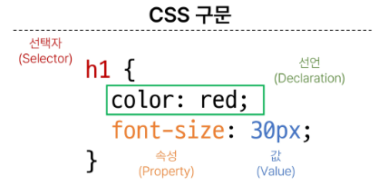

# Fundamentals of HTML and CSS
- 웹 소개
- 웹 구조화
  - HTML
  - HTML의 구조
  - 텍스트 구조
- 웹 스타일링
  - CSS
  - CSS 선택자
  - 우선순위
---
# 웹 소개
- World Wide Web
  - 인터넷으로 연결된 컴퓨터들이 정보를 공유하는 거대한 정보 공간

- Web
  - Web site, Web application 등을 통해 사용자들이 정보를 검색하고 상호 작용하는 기술

- Web site
  - 인터넷에서 여러 개의 Web page가 모인 것으로, 사용자들에게 정보나 서비스를 제공하는 공간

- Web page
  - HTML, CsS등의 웹 기술을 이용하여 만들어진, "Web site"를 구성하는 하나의 요소

## Web page 구성 요소
(유사한 예시)
- House
  - "Structure"
    - Steel Frame(철물 구조)
  - "Styling"
    - Paint(집 도색)
  - "Behavior"
    - Turn on light(집에서 수행하는 동작들)
(실제 구조)
- Web page
  - HTML
    - "Structure
  - CSS
    - "Styling"
  - Javascript
    - "Behavior"

---
# 웹 구조화
## HTML
- HyperText Markup Language
- 웹 페이지의 의미와 **구조**를 정의하는 언어

- Hypertext
  - 웹 페이지를 다른 페이지로 연결하는 링크
  - 참조를 통해 사용자가 한 문서에서 다른 문서로 즉시 접근할 수 있는 텍스트

### Markup language
- 태그 등을 이용하여 문서나 데이터의 구조를 명시하는 언어
- (ex) HTML, Markdown

예시
> HTML. HTML 이란 Hyper Tex Markup Language 의 약자이다. 성모은 Text. Hyper Text 란 기존의 선형적인 텍스트가 아닌 비 선형적으로 이루어진 텍스트를 의미하며, 이는 인터넷의 등장과 함께 대두되었다. 기본적으로 HyperLink를 통해 텍스트를 이동한다. 이러한 Hyper Text 는 인간이 긴억하는 방식까지 바꾸고 있는데 이는 컬럼비아대 벳시 수패로 교수팀은 구글 효과(Google Efreot) 라고 이름붙이고, 해당 연구들"사이언스' 지에 게재하였다. 구글 효과(Google Effect). 구글 효과란..

- 가독성이 좋아짐..
<h1>HTML</h1>
<p> HTML 이란 Hyper Text Markup Language의 약자이다. </p>
<h2>Hyper Text</h2>
Hyper Text 란 기존의 선형적인 텍스트가 아닌 비 선형적으로 이루어진 텍스트를 의미하며, 이는 인터넷의 등장과 함께 대두되었다. 기본적으로 HyperLink를 통해 텍스트를 이동한다. 이러한 Hyper Text 는 인간이 긴억하는 방식까지 바꾸고 있는데 이는 컬럼비아대 벳시 수패로 교수팀은 구글 효과(Google Efreot) 라고 이름붙이고, 해당 연구들"사이언스' 지에 게재하였다
<p> 이러한 Hyper Text는 인간이 기억하는 방식까지 바꾸고 있는데 이들 컬럼비아대 벳시 스페로 교수팀은 구글 효과(Google Etfect) 라고 이름뿐이고 해당 인구를 '사이언스' 지에 게재하였다. </p>

<h2>구글 효과(Google Effect) </h2>
<p> 구글효과란 .. </p>

### HTML 실습
|코드|내용|
|-|-|
| `<!DOCTYPE html>` | 문서 타입을 검사| 
| `<html>  </html>` | 시작과 끝, 한쌍으로 이루어짐| 
| `lang="en"` | 기본적으로 읽힐 언어| 
| `<meta charset = 'UTF\|8'>` | 닫는 태그가 없음 (안에 들어갈 내용이 없음)| 
| `<head> </head>` | 머리| 
| `<body> </body`  | 몸통| 

### HTML 구조 
- Head(tab에서 보임)
- Body(웹 페이지에서 일반적으로 보이는것)
```html
<!DOCTYPE html>
<html lang="en">
<head>
  <meta charset = 'UTF-8'>
  <title>My Page</title>
</head>
<body>
  <p>This is my page</p>
</body>
</html>
```
### Tip
- `alt + B` 
- 웹 열어주기
- 구글링할때 MDN 붙여서 검색

### HTML 요소
- 하나의 요소는 여는 태그와 닫는 태그가 있음(없는 것도 있다)

### HTML 속성
- 규칙
  - 속성은 요소 이름과 속성 사이에 공백이 있어야 함
  - 하나 이상의 속성들이 있는 경우엔 속성사이에 공백으로 구분함
  - 속성값은 열고 닫는 따옴표로 감싸야 함
- 목적
  - 나타내고 싶지 않지만 추가적인 기능, 내용을 담고싶을때 사용
  - CSS에서 해당 요소를 선택하기 위한 값으로 활용됨
- **태그 이름 + tab** 하면 자동완성됨
- a 태그는 링크를 연결해줌
  - (ex) `<a href="https://www.google.co.kr/">google</a>`
- img 태그는 이미지를 연결해줌
  - (ex) 로컬이미지 
  - ``
  - (ex) 링크 이미지
  - ``  alt는 이미지 설명 (보통 AI가 채움)

### HTML Text structure
- HTML의 주요 목적 중 하나는 **텍스트 구조와 의미를 제공**하는 것
- h1 -> 문서의 최상위 제목이라는 의미 부여
- 느낌표 tab 하면 기본 틀 자동완성

|코드|내용|
|-|-|
|`<h1></h1>`|대주제|
|`<h2></h2>`|소주제|
|`<em></em>`|기울이기|
|`<strong></strong>`|볼드체|
|`<ol></ol>`|순차 목록(1.2.3.)|
|`<li></li>`|목록 리스트|
|`<ul></ul>`|비순차 목록|


---

# 웹 스타일링
## CSS
- 웹페이지의 **디자인과 레이아웃**을 구성하는 언어


- 선택자 h1
- `속성: 값;` -> 선언

### 적용 방법
1. 인라인 스타일(가장 지양)
    - HTML 요소 안에 style 속성값으로 작성
2. 내부 스타일 시트
    - head 태그 안에 style 태그에 작성
3. 외부 스타일 시트(가장 추천 - 재사용성,깔끔)
    - 별도의 CSS 파일 생성 후 HTML link 태그를 사용해 불러오기

### CSS 선택자
- HTML 요소를 선택하여 스타일을 적용할 수 있도록 하는 선택자
  1. 전체 선택자 (*)
      - HTML 모든 요소를 선택
  2. 요소 선택자
      - 지정한 모든 태그를 선택
  3. 클래스 선택자
      - 주어진 클래스 속성을 가진 모든 요소를 선택
  4. 아이디 선택자
      - 주어진 아이디 속성을 가진 요소 선택
      - 문서에는 주어진 아이디를 가진 요소가 **하나만** 있어야함

```html
  <style>
    /* 1. 전체 선택자 */
    *{
      color: red;
    }
    /* 2. 요소 선택자 */
    /* 모든 h2 요소의 텍스트 색을 주황색으로 변경 */
    h2 {
      color: orange;
    }
    h3, h4 {
      color: blue;
    }
    /* 3. 클래스 선택자 */
    /* 재사용 가능 99퍼 이걸로 사용 */
    .green {
      color: green;
    }
    /* 4. 아이디 선택자 */
    /* 하나만 변경해줌 */
    #purple {
      color: purple;
    }
  </style>
```
### 결합자
1. 자손 결합자 (""(space))
2. 자식 결합자(">")
   - 첫번째 요소의 직계 자식만 선택
   - ul > li 는 <ul> 안에 있는 모든 <li>를 선택(한단계 아래 자식들만)

```html
  <style>
    /* 3. 클래스 선택자 */
    /* 재사용 가능 99퍼 이걸로 사용 */
    .green {
      color: green;
    }

    /* 자식 결합자 */
    .green > span {
      font-size: 50px;
    }
    /* 자손 결합자 */
    .green li {
      color: brown;
    }

  </style>
```
---
### 우선순위
- 동일한 요소에 적용 가능한 스타일을 두가지 이상 작성했을때, 어떤 규칙이 적용되는지 결정하는 것
- 같은 선택자일때는 마지막에 선택된게 출력되지만, 우선순위가 다른 선택자에서는 우선순위가 높은 순으로 출력

1. important - !important
   - 다른 우선순위 규칙보다 우선하여 적용하는 키워드
2. Inline 스타일
3. 선택자
    - id 선택자 > **class 선택자** > 요소 선택자
4. 소스코드 순서

---
### CSS 상속
- 기본적으로 CSS는 상속을 통해 부모 요소의 속성을 자식에게 상속해 재사용성을 높임
- 상속 여부
  - 상속되는 속성
    - **text 관련** 요소(font, color, text-align),opacity, visibility 등
  - 상속되지 않는 속성
    - **Box model 관련** 요소(width, height, border, box-sizing)
    - position 관련 요소(position, top/right/bottom/left, z-index)