# CSS Box Model List
- 구성 요소
- 박스 타입
- 기타 display 속성
- CSS Layout Position
- CSS Position
- CSS Layout Flexbox

# CSS Box Model
- 모든 HTML 요소를 사각형 박스로 표현하는 개념
- 내용(content), 안쪽 여백(padding), 테두리(border), 외부 간격(margin)으로 구성되는 개념

## Box 구성요소
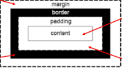
- Margin
- 이 박스와 다른 요소 사이의 공백, 가장 바깥쪽 영역
- Padding
- 콘텐츠 주위에 위치하는 공백 영역
- Border
- 테두리 영역
- Content
- 콘텐츠가 표시되는 영역
## Box 구성의 방향 별 명칭
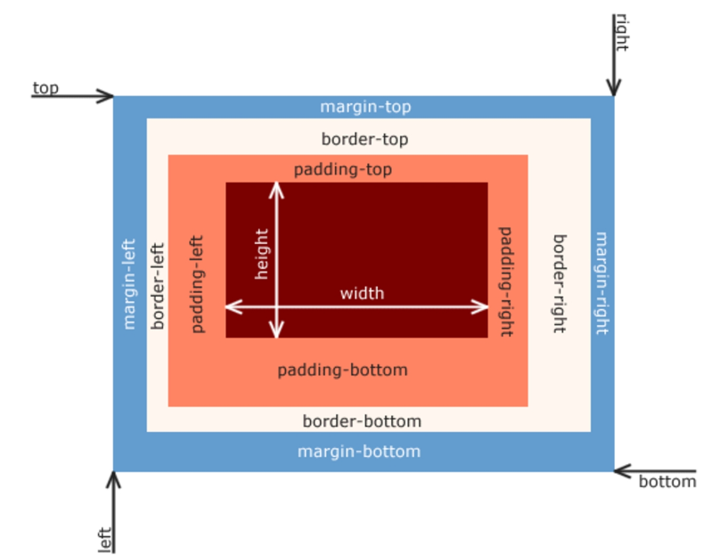
```
border-width: 3px;
border-color: black;
border-style: solid;
    
-> 한줄로 축소 가능  
border: 3px black solid;
```

```html
.box1 {
      width: 200px;
      /* 박스 안에서 콘텐츠만 옮기고 싶으면 padding */
      padding-left: 25px;
      padding-bottom: 50px;
      border-width: 3px;
      border-color: black;
      border-style: solid;
      /* 박스 자체를 옮기고 싶을때 margin */
      margin-left: 25px;
      margin-bottom: 50px;
    }
    
.box2 {
      width: 200px;
      /* 세가지 속성 한번에 적을수 있음 */
      border: 3px black dashed;
      
      /* 1. 가운데 정렬 */
      /* 기본적으로 좌측정렬이 되어있음 -> margin right 값이 존재 */
      /* 기본적으로 갖고 있는 margin right 를 왼쪽에 모두 줌 */
      /* margin-left: auto; */
      /* 오른쪽에도 나눠줘서 반반 -> 가운데 정렬 */
      /* margin-right: auto; */

      /* 2. 전체 주변에 margin 동일하게 주는 법 */
      /* 단축속성에서 이렇게 적으면 상하좌우 모두 해당됨 */
      margin: 100px auto;
      /* 단축속성에서 값을 두개를 쓰면 상하 / 좌우 나눠짐 */
      padding: 25px, 50px;
    }
```
## width & height 속성
- 요소의 너비와 높이를 지정
- 이때 지정되는 요소의 너비와 높이는 콘텐츠 영역을 대상으로 함
-  CsS가 width 값을 계산하는 기준
   -  =css는 border가 아닌 content의 크기를 width 값으로 지정
  
```html
<!DOCTYPE html>
<html lang="en">

<head>
  <meta charset="UTF-8">
  <meta http-equiv="X-UA-Compatible" content="IE=edge">
  <meta name="viewport" content="width=device-width, initial-scale=1.0">
  <title>Document</title>
  <style>
    .box {
      /* 실제 박스의 크기는 padding, margin 합쳐서 100이 넘음 */
      /* 콘텐츠 기준으로 100 */
      width: 100px;
      border: 2px solid black;
      padding: 10px;
      margin: 20px;
      background-color: yellow;
    }

    .content-box {
      /* 기본 너비 높이 속성이 content 기준 */
      box-sizing: content-box;
    }

    .border-box {
      /* margin까지 적용해서 크기 정하려면 이렇게 바꿔주기 */
      box-sizing: border-box;
    }
  </style>
</head>

<body>
  <div class="box content-box">content-box</div>
  <div class="box border-box">border-box</div>
</body>

</html>

```
---
# 박스타입
- Normal flow
  - CSS를 적용하지 않았을 경우 웹페이지 요소가
기본적으로 배치되는 방향

## block 타입 특징
- 항상 새로운 행으로 나뉨 -> 왼쪽부터 시작해서 오른쪽의 모든 영역을 margin으로 차지함
- width와 height 속성을 사용하여 너비와 높이를 지정할 수 있음
- 기본적으로 width 속성을 지정하지 않으면 박스는 inline 방향으로 사용 가능한 공간을 모두 차지함
(너비를 사용가능한 공간의 100%로 채우는 것)
- 대표적인 block 타입 태그
  - hi~6, P, div

## inline 타입 특징
- 새로운 행으로 나뉘지 않음 -> 옆으로 쌓이는 형태
- **width와 height 속성을 사용할 수 없음**
- 수직 방향 (상하)
  - padding, margins, borders가 적용되지만 다른 요소를 밀어낼 수는 없음
- 수평 방향 (좌우)
  - padding, margins, borders가 적용되어 다른 요소를 밀어낼 수 있음
- 대표적인 inline 타입 태그
  - a, img, span

## 속성에 따른 수평 정렬
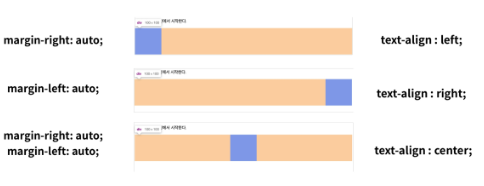
## inline-block
- inline과 block 요소 사이의 중간 지점을 제공하는 display 값
- block 요소의 특징을 가짐  
  - width 및 height 속성 사용 가능
  - padding, margin 및 border 로 인해 다른 요소가 밀려남
- 요소가 **줄 바꿈 되는 것을 원하지 않으면서 너비와 높이를 적용하고 싶은 경우**에 사용
- `display: inline-block;`

### 참고
- 리스트를 인라인 블럭으로 바꿔서 네비게이션바로 활용가능
- 인라인 블럭은 부모에게 text-align  속성을 주어 가운데 정렬

## none
- 요소를 화면에 표시하지 않고 공간조차 부여하지 않음
- `display: none;`
- 자바스크립트랑 같이 사용됨(동작과 함께)
---
# CSS Layout Position
## CSS Layout
- 각 요소의 위치와 크기를 조정하여 웹페이지의 디자인을 결정하는 것
- display, position, float, flexbox
## CSS Position
- 요소를 Normal Flow 에서 제거하여 다른 위치로 배치하는 것
- 다른 요소 위에 올리기, 화면의 특정 위치에 고정시키기
- 다른 요소 위에 쌓으려면 축이 하나 더 필요함
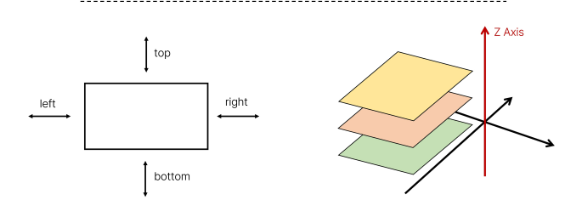
1. static
2. relative
3. absolute
4. fixed
5. sticky
  
## static
- 기본값
- 요소를 normal flow에 따라 배치
```html
.static {
  /* static 은 position의 기본값 */
  position: static;
  background-color: lightcoral;
}
```
## relative
- 요소를 normal flow에 따라 배치
- 자기 자신을 기준으로 이동
- 요소가 차지하는 공간은 static일 때와 같음
```html
.relative {
  /* 상대적인 위치의 기준점은 자기 원위치 */
  position: relative;
  background-color: lightblue;
  /* 우측 하단으로 이동 */
  top: 100px;
  left: 100px;
}
```
## absolute
- 요소를 normal flow에서 제거
- 가장 가까운 relative 부모 요소를 기준으로 이동
- 문서에서 요소가 차지하는 공간이 없어짐
```html
.container {
  /* abolute 의 부모가 되는 기준점 */
  position: relative;
  height: 300px;
  width: 300px;
  border: 1px solid black;
}
.absolute {
  /* 본인의 영역을 버려서 다른 요소들이 그 영역만큼 이동함 */
  position: absolute;
  background-color: lightgreen;
  /* static이 아닌 부모를 찾아 올라감 (기준점 찾기 위해) */
  /* static이 아닌 부모를 못찾으면 결국 body 까지 올라감 */
  /* relative 부모를 두고 사용함 */
  top: 100px;
  left: 100px;
}
```
## fixed
- 요소를 normal flow에서 제거
- 현재 화면영역 viewport 기준으로 이동
- 문서에서 요소가 차지하는 공간이 없어짐 
```html
.fixed {
  /* absolute랑 비슷하게 영역을 버림 */
  /* 하지만 fixed는 우리가 보는 화면에 붙어있음 스크롤 밑으로 내려도 고정 */
  position: fixed;
  background-color: gray;
  /* top: 0; */
  /* right: 0; */
}
```
## sticky
- 요소를 Normal flow 따라 배치
- 요소가 일반적인 문서 흐름에 따라 배치되다가 스크롤이 특정 임계점에 도달하면 그위치에서 고정됨
- 만약 다음 sticky 요소가 나오면 다음 sticky 요소가 이전 sticky 요소의 자리를 대체
  - 이전 sticky 요소가 고정되어있던 위치와 다음 sticky 요소가 고정되어야 할 위치가 겹치게 되기 때문
```html
    .sticky {
      /* 스크롤을 내리다가 top 0이 됨과 동시에 fixed*/
      /* -> 다음 sticky 요소가 나올때까지 고정  */
      position: sticky;
      /* 변화가 되는 임계점 */
      /* top 0가 되었을때 fixed의 특징이 생김 */
      top: 0;
      background-color: lightblue;
      padding: 20px;
      border: 2px solid black;
    }
```
## z- index 특징
- 정수 값을 사용해 z축 순서를 지정
- 더 큰 값을 가진 요소가 작은 값의 요소를 덮음
- `z-index: 3;`
- 음수를 주는 경우 -> 모든것의 아래에 있어야할때
- 99999주는 경우 -> 맨앞에 고정시켜야 할때

```html
    .red {
      background-color: red;
      top: 50px;
      left: 50px;
      z-index: 3;
    }

    .green {
      background-color: green;
      top: 100px;
      left: 100px;
      z-index: 2;
    }

    .blue {
      background-color: blue;
      top: 150px;
      left: 150px;
      z-index: 1;
    }
```
---
# CSS Flexbox
- 요소를 행과 열 형태로 배치하는 1차원 레이아웃 방식
- 공간 배열 & 정렬
- 구성요소
- 부모 기준 -> container
- 자식은 부모기준으로 정렬됨 -> item
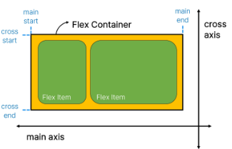
- **main axis** (주 축)
  - flex item 들이 배치되는 기본 축
  - main start에서 시작하여 main end 방향으로 배치
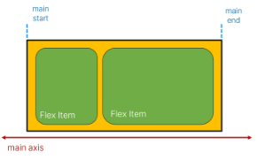
- cross axis(교차축)
  - **main axis 에 수직**인 축
  - cross start에서 시작하여 cross end 방향으로 배치
- Flex container
  - display : flex; 혹은 display: inline-flex; 가 설정된 부모요소
  - 이 컨테이너의 1차 자식 요소들이 flex item이 됨
  - flexbox 속성값들을 사용하여 자식요소 flex item들을 배치

---
## 레이아웃 구성
1. Flex Container 지정
   - flex item 은 기본적으로 행으로 나열
   - flex item 은 주축의 시작선에서 시작
   - flex item 은 교차축의 크기를 채우기 위해 늘어남

2. flex- direction
   - flex item 이 나열되는 방향을 지정
   - column으로 지정할 경우 주 축이 변경됨
   - -reverse로 지정하면 시작 선과 끝 선이 서로 바뀜
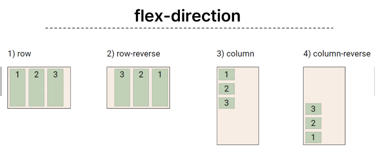
3. flex-wrap
   - flex item 목록이 flex container의 하나의 행에 들어가지 않을 경우 다른 행에 배치할지 여부 설정
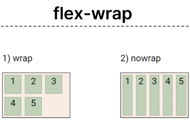
4. justify- content
   - 주 축을 따라 flex item과 주위 공간을 분배
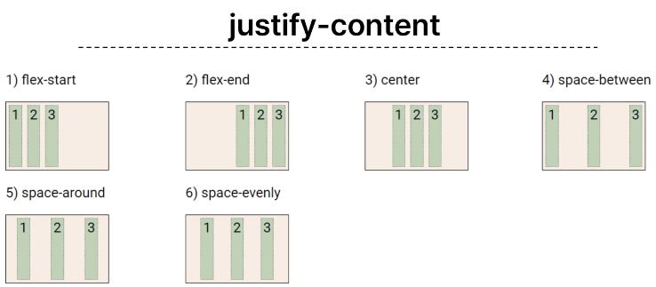
5. align-content
   - 교차 축을 따라 flex item과 주위에 공간을 분배
   - flex wrap이 wrap 또는 wrap-reverse로 설정된 여러 행에만 적용됨
   - 한줄짜리 행에는 효과 없음
   - 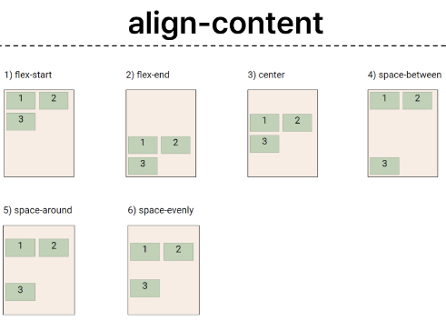
1. align-item
   - 교차 축을 따라 flex item 행을 정렬
   - 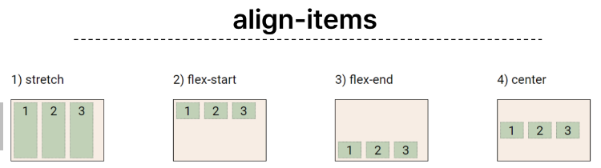
2. align-self
   - 교차 축을 따라 개별 flex item을 정렬
   - 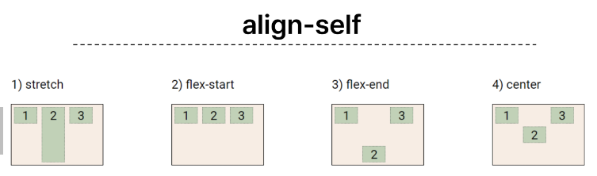

```html
<!DOCTYPE html>
<html lang="en">

<head>
  <meta charset="UTF-8">
  <meta http-equiv="X-UA-Compatible" content="IE=edge">
  <meta name="viewport" content="width=device-width, initial-scale=1.0">
  <title>Document</title>
  <style>
    .container {
      height: 500px;
      border: 1px solid black;
      /* 1. flex container 지정 */
      display: flex;
      /* 2. flex direction(메인 축) 지정 */
      /* 기본 row */
      /* flex-direction: row; */
      /* 기본 거꾸로 */
      /* flex-direction: row-reverse; */
      /* 수직 */
      flex-direction: column;
      /* 수직 거꾸로 */
      /* flex-direction: column-reverse; */
      
      /* 3.flex-wrap */
      /* nowrap이 기본 */
      flex-wrap: wrap;

      /* 4. 축정렬 */
      /* 기본값 flex start */
      /* 가운데정렬 center */
      justify-content: center;
      /* 오른쪽 정렬 flex - end */

      /* 5. 교차축 정렬 */
      align-content: flex-start;

      /* 행 하나 정렬 */
      align-items: center;
    }

    .post {
      background-color: grey;
      border: 1px solid black;
      margin: 0.5rem;
      padding: 0.5rem;
    }

    .item1 {
      /*  개별로 움직이고 싶을때만  */
      align-self: center;
    }

    .item2 {
      align-self: flex-end;
    }
  </style>
</head>

<body>
  <div class="container">
    <div class="post item1">
      <h2>Post Title 1</h2>
      <p>Post Content 1</p>
    </div>
    <div class="post item2">
      <h2>Post Title 2</h2>
      <p>Post Content 2</p>
    </div>
    <div class="post">
      <h2>Post Title 3</h2>
      <p>Post Content 3</p>
    </div>
    <div class="post">
      <h2>Post Title 4</h2>
      <p>Post Content 4</p>
    </div>
  </div>

</body>

</html>
```
### 목적에 따른 분류
| 배치| 공간분배| 정렬|
|-|-|-|
 flex-dirction, flex-wrap| justify-content,align-content| align-otems, align-self|

---
### flex-grow
- 남는 행 여백을 비율에 따라 각 flex item 에 **분배**
  - 결과적으로 비율이 맞는게 아니라 남는 부분을 나눠가지는거임

### flex-basis
- flex item의 초기 크기 값을 지정
- flex-basis 와 width 값을 동시에 적용한 경우 flex-basis가 우선

---
## 반응형 레이아웃
- 다양한 디바이스와 화면 크기에 자동으로 적응하여 콘텐츠를 최적으로 표시하는 웹 레이아웃 방식
```html
.card {
  width: 80%;
  border: 1px solid black;
  /* 1 원래는 수직이였는데 양옆으로 정렬*/
  display: flex;
  /* 2 줄이다 보면 글을 아래줄로 떨어뜨리기*/
  flex-wrap: wrap;
}
img {
  width: 100%;
}
.thumbnail {
  /* 3 처음 초기 크기 지정*/
  flex-basis: 700px;
  /* 4 남는 화면분배*/
  flex-grow: 1;
  /* flex: 1 700px; */
}
.content {
  /* 3 */
  flex-basis: 350px;
  /* 4 */
  flex-grow: 1;
  /* flex: 1 350px; */
}
```

## 참고
- 한줄로 해결할때
  - border : 2px solid black;
  - flex-flow: flex-direction flex-wrap;
  - 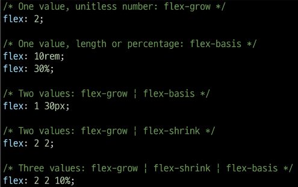
- 주어진 값 개수에 따라 적용되는 위치
  - margin: 상 / 우 / 하 / 좌
  - padding : 상 / 좌우 / 하
  - margin : 상하 / 좌우
  - padding : 상하좌우

- 마진 상쇄
  - top + bottom이 만나면 더 큰 margin으로 결합

- position의 역할
  - 전체 페이지에 대한 레이아웃을 구성하는 것이 아닌 페이지의 특정항목의 위치를 조정하는 것에 관한 것
- justify-items 및 justify-self 속성이 없는 이유
  - margin auto를 통해 정렬 및 배치가능
  