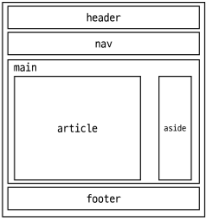

# Bootstrap
- CSS 프론트엔드 프레임워크(TOOIKit)
- 미리 만들어진 다양한 디자인 요소들을 제공하여 웹 사이트를 빠르고 쉽게 개발할 수 있도록 함

- [Bootstrap 공식 문서](https://getbootstrap.com/)
- Docs -> Introduction -> Quick start

- Head에 넣을 CSS 링크
  - `<link href="https://cdn.jsdelivr.net/npm/bootstrap@5.3.1/dist/css/bootstrap.min.css" rel="stylesheet" integrity="sha384-4bw+/aepP/YC94hEpVNVgiZdgIC5+VKNBQNGCHeKRQN+PtmoHDEXuppvnDJzQIu9" crossorigin="anonymous">
`
- Body에 넣을 자바스크립트 링크    
  - `<script src="https://cdn.jsdelivr.net/npm/bootstrap@5.3.1/dist/js/bootstrap.bundle.min.js" integrity="sha384-HwwvtgBNo3bZJJLYd8oVXjrBZt8cqVSpeBNS5n7C8IVInixGAoxmnlMuBnhbgrkm" crossorigin="anonymous"></script>
`

## Bootstrap 기본 사용법
`<p class="mt-5"›Hello, world!</p> `

|m|t|-|5|
|-|-|-|-|
|{property}|{sides}|-|{size}|

- property
  - m : margin
  - p : padding
- sides
  - t : top
  - b : bottom
  - s : left
  - e : right
  - y : top,bottom
  - x : left,right
  - blank : 4  sides
- Size
  - 0 : 0 rem == 0 px
  - 1 : 0.25 rem ==40 px
  - 2 : 0.5 rem == 8 px
  - 3 : 1 rem == 16 px
  - 4 : 1.5 rem == 24 px
  - 5 : 3 rem == 48 px
  - auto : auto == auto
  
- Bootstrap에는
특정한 규칙이 있는 클래스 이름으로 이미 스타일 및 레이아웃이 작성되어 있음

# Typography
- 제목, 본문 텍스트, 목록 등
- [typo 링크](https://getbootstrap.com/docs/5.3/content/typography/)
- Display headings
    - 기존 Heading보다 더 눈에 띄는 제목이 필요할 경우 (더 크고 약간 다른 스타일)
```html
<!-- Display Heading --> 
<h1 class= "display-1"›Display 1</h1>
<h1 class="display-2"›Display 2</h1>
<h1 class="display-3"›Display 3</h1>
<h1 class="display-4"›Display 4</h1>
<h1 class= "display-5"›Display 5</h1>
<h1 class="display-6"›Display 6</h1>
```
- Inline text elements
  - HTML inline 요소에 대한 스타일
```html
<p>You can use the mark tag to <mark>highlight</mark> text.</p>
<p><del>This line of text is meant to be treated as deleted text.</del></p>
<p><s>This line of text is meant to be treated as no longer accurate.</s></p>
<p><ins>This line of text is meant to be treated as an addition to the document.</ins></p>
<p><u>This line of text will render as underlined.</u></p>
<p><small>This line of text is meant to be treated as fine print.</small></p>
<p><strong>This line rendered as bold text.</strong></p>
<p><em>This line rendered as italicized text.</em></p>
```

- Lists
  - HTML list 요소에 대한 스타일
```html
<ul class="list-unstyled">
  <li>This is a list.</li>
  <li>It appears completely unstyled.</li>
  <li>Structurally, it's still a list.</li>
  <li>However, this style only applies to immediate child elements.</li>
  <li>Nested lists:
    <ul>
      <li>are unaffected by this style</li>
      <li>will still show a bullet</li>
      <li>and have appropriate left margin</li>
    </ul>
  </li>
  <li>This may still come in handy in some situations.</li>
</ul>
```
---
# Color
## Bootstrap Color system
- Bootstrapol 지정하고 제공하는 색상 시스템
- Text, Border, Background 및 다양한 요소에 사용하는 Bootstrap의 색상 키워드
- [Text colors](https://getbootstrap.com/docs/5.3/utilities/colors/#colors)

```html
<p class="text-primary">.text-primary</p>
<p class="text-primary-emphasis">.text-primary-emphasis</p>
<p class="text-secondary">.text-secondary</p>
<p class="text-secondary-emphasis">.text-secondary-emphasis</p>
<p class="text-success">.text-success</p>
<p class="text-success-emphasis">.text-success-emphasis</p>
<p class="text-danger">.text-danger</p>
<p class="text-danger-emphasis">.text-danger-emphasis</p>
<p class="text-warning bg-dark">.text-warning</p>
<p class="text-warning-emphasis">.text-warning-emphasis</p>
<p class="text-info bg-dark">.text-info</p>
<p class="text-info-emphasis">.text-info-emphasis</p>
<p class="text-light bg-dark">.text-light</p>
<p class="text-light-emphasis">.text-light-emphasis</p>
<p class="text-dark bg-white">.text-dark</p>
<p class="text-dark-emphasis">.text-dark-emphasis</p>

<p class="text-body">.text-body</p>
<p class="text-body-emphasis">.text-body-emphasis</p>
<p class="text-body-secondary">.text-body-secondary</p>
<p class="text-body-tertiary">.text-body-tertiary</p>

<p class="text-black bg-white">.text-black</p>
<p class="text-white bg-dark">.text-white</p>
<p class="text-black-50 bg-white">.text-black-50</p>
<p class="text-white-50 bg-dark">.text-white-50</p>
```
- Background colors
```html
<div class="p-3 mb-2 bg-primary text-white">.bg-primary</div>
<div class="p-3 mb-2 bg-primary-subtle text-emphasis-primary">.bg-primary-subtle</div>
<div class="p-3 mb-2 bg-secondary text-white">.bg-secondary</div>
<div class="p-3 mb-2 bg-secondary-subtle text-emphasis-secondary">.bg-secondary-subtle</div>
<div class="p-3 mb-2 bg-success text-white">.bg-success</div>
<div class="p-3 mb-2 bg-success-subtle text-emphasis-success">.bg-success-subtle</div>
<div class="p-3 mb-2 bg-danger text-white">.bg-danger</div>
<div class="p-3 mb-2 bg-danger-subtle text-emphasis-danger">.bg-danger-subtle</div>
<div class="p-3 mb-2 bg-warning text-dark">.bg-warning</div>
<div class="p-3 mb-2 bg-warning-subtle text-emphasis-warning">.bg-warning-subtle</div>
<div class="p-3 mb-2 bg-info text-dark">.bg-info</div>
<div class="p-3 mb-2 bg-info-subtle text-emphasis-info">.bg-info-subtle</div>
<div class="p-3 mb-2 bg-light text-dark">.bg-light</div>
<div class="p-3 mb-2 bg-light-subtle text-emphasis-light">.bg-light-subtle</div>
<div class="p-3 mb-2 bg-dark text-white">.bg-dark</div>
<div class="p-3 mb-2 bg-dark-subtle text-emphasis-dark">.bg-dark-subtle</div>
<p class="p-3 mb-2 bg-body-secondary">.bg-body-secondary</p>
<p class="p-3 mb-2 bg-body-tertiary">.bg-body-tertiary</p>

<div class="p-3 mb-2 bg-body text-body">.bg-body</div>
<div class="p-3 mb-2 bg-black text-white">.bg-black</div>
<div class="p-3 mb-2 bg-white text-dark">.bg-white</div>
<div class="p-3 mb-2 bg-transparent text-body">.bg-transparent</div>
```
## Bootstrap 실습
- 너비와 높이가 각각200px인 정사각형 작성하기
(너비와 높이를 제외한 스타일은 모두 bootstrap으로 작성)
- [border](https://getbootstrap.com/docs/5.3/utilities/borders/#border)
- `<div class="box border border-2 border-dark bg-info"></div>`

# Component
- Bootstrap Component
  - Bootstrap에서 제공하는 이 관련 요소
  - 버튼, 네비게이션 바, 카드, 폼, 드롭다운 등

- 대표 Component 사용해보기
  - [Alerts](https://getbootstrap.com/docs/5.3/components/alerts/)
    - ```html
      <div class="alert alert-primary" role="alert">
      A simple primary alert—check it out!
      </div>
      ```
  - [Badges](https://getbootstrap.com/docs/5.3/components/badge/)
    - ```html
      <span class="badge text-bg-primary">Primary</span>
      ```
  - [**Buttons**](https://getbootstrap.com/docs/5.3/components/buttons/)
    - ```html
      <button type="button" class="btn btn-outline-primary">Primary</button>
      ```
    - button 태그 안써도 됨 -> a 태그도 가능 
  - [**Cards**](https://getbootstrap.com/docs/5.3/components/card/)
    - ```html
      <div class="card" style="width: 18rem;">
        
        <div class="card-body">
          <h5 class="card-title">Card title</h5>
          <p class="card-text">Some quick example text to build on the card title and make up the bulk of the card's content.</p>
          <a href="#" class="btn btn-primary">Go somewhere</a>
        </div>
      </div>

      ```
  - [Navbar](https://getbootstrap.com/docs/5.3/components/navbar/)
## Casosal
```html
<!DOCTYPE html>
<html lang="en">

<head>
  <meta charset="UTF-8">
  <meta name="viewport" content="width=device-width, initial-scale=1.0">
  <link href="https://cdn.jsdelivr.net/npm/bootstrap@5.3.1/dist/css/bootstrap.min.css" rel="stylesheet" integrity="sha384-4bw+/aepP/YC94hEpVNVgiZdgIC5+VKNBQNGCHeKRQN+PtmoHDEXuppvnDJzQIu9" crossorigin="anonymous">
  <title>Document</title>
</head>

<body>
  <div id="carouselExample" class="carousel slide">
    <div class="carousel-inner">
      <div class="carousel-item active">
        
      </div>
      <div class="carousel-item">
        
      </div>
      <div class="carousel-item">
        
      </div>
    </div>
    <!-- data-bs-target 어딜 움직일것인지에 대한 코드 -->
    <!-- 두개를 별도로 움직이기 위해선 id와 타겟을 따로 지정해줄것 -->
    <button class="carousel-control-prev" type="button" data-bs-target="#carouselExample" data-bs-slide="prev">
      <span class="carousel-control-prev-icon" aria-hidden="true"></span>
      <span class="visually-hidden">Previous</span>
    </button>
    <button class="carousel-control-next" type="button" data-bs-target="#carouselExample" data-bs-slide="next">
      <span class="carousel-control-next-icon" aria-hidden="true"></span>
      <span class="visually-hidden">Next</span>
    </button>
  </div>
  <div id="carouselExample2" class="carousel slide">
    <div class="carousel-inner">
      <div class="carousel-item active">
        
      </div>
      <div class="carousel-item">
        
      </div>
      <div class="carousel-item">
        
      </div>
    </div>
    <button class="carousel-control-prev" type="button" data-bs-target="#carouselExample2" data-bs-slide="prev">
      <span class="carousel-control-prev-icon" aria-hidden="true"></span>
      <span class="visually-hidden">Previous</span>
    </button>
    <button class="carousel-control-next" type="button" data-bs-target="#carouselExample2" data-bs-slide="next">
      <span class="carousel-control-next-icon" aria-hidden="true"></span>
      <span class="visually-hidden">Next</span>
    </button>
  </div>
  <script src="https://cdn.jsdelivr.net/npm/bootstrap@5.3.1/dist/js/bootstrap.bundle.min.js" integrity="sha384-HwwvtgBNo3bZJJLYd8oVXjrBZt8cqVSpeBNS5n7C8IVInixGAoxmnlMuBnhbgrkm" crossorigin="anonymous"></script>
</body>

</html>
```
## modal
- 같이 데리고 다니기보다 밑으로 따로 모아서 관리하는게 편함
- carosal과 같이 아이디로 타겟 설정할것
```html
<!DOCTYPE html>
<html lang="en">

<head>
  <meta charset="UTF-8">
  <meta name="viewport" content="width=device-width, initial-scale=1.0">
  <link href="https://cdn.jsdelivr.net/npm/bootstrap@5.3.1/dist/css/bootstrap.min.css" rel="stylesheet" integrity="sha384-4bw+/aepP/YC94hEpVNVgiZdgIC5+VKNBQNGCHeKRQN+PtmoHDEXuppvnDJzQIu9" crossorigin="anonymous">
  <title>Document</title>
</head>

<body>
    <!-- Button trigger modal -->
  <button type="button" class="btn btn-primary" data-bs-toggle="modal" data-bs-target="#exampleModal">
    Launch demo modal
  </button>

  <!-- Modal은 따로 모아놓는 편이 편함-->
  <div class="modal fade" id="exampleModal" tabindex="-1" aria-labelledby="exampleModalLabel" aria-hidden="true">
    <div class="modal-dialog">
      <div class="modal-content">
        <div class="modal-header">
          <h1 class="modal-title fs-5" id="exampleModalLabel">Modal title</h1>
          <button type="button" class="btn-close" data-bs-dismiss="modal" aria-label="Close"></button>
        </div>
        <div class="modal-body">
          ...
        </div>
        <div class="modal-footer">
          <button type="button" class="btn btn-secondary" data-bs-dismiss="modal">Close</button>
          <button type="button" class="btn btn-primary">Save changes</button>
        </div>
      </div>
    </div>
  </div>
  <script src="https://cdn.jsdelivr.net/npm/bootstrap@5.3.1/dist/js/bootstrap.bundle.min.js" integrity="sha384-HwwvtgBNo3bZJJLYd8oVXjrBZt8cqVSpeBNS5n7C8IVInixGAoxmnlMuBnhbgrkm" crossorigin="anonymous"></script>

</body>

</html>
```
## Component 이점
- 일관된 디자인을 제공하여
웹 사이트의 구성 요소를 구축하는 데 유용하게 활용
- 단점 : 자유도 떨어짐
---
# Semantic Web
- 웹 데이터를 의미론적으로 구조화된 형태로 표현하는 방식

- "이 요소가 시각적으로 어떻게 보여질까?" ->
"이 요소가 가진
목적과 역할은 무엇일까?"

- 예시 -> "문서의 최상위 제목"
  - `<span style="font-size: 30px;">Heading</span>
  `
    - 단순히 최상위 제목"처럼" 보이게 출력하는 것

  - `<h1> Heading </h1>`
    - 페이지 최상위 제목 의미를 제공하는
semantic 요소 h1
    - 브라우저의 의해 제목처럼 보이도로
스타일이 지정됨

## HTML Semantic Element
- 기본적인 모양과 기능 이외에 의미를 가지는 HTML 요소
- 검색엔진 및 개발자가 웹 페이지 콘텐츠를 이해하기 쉽도록(실상 원래 있는 div나 비슷한 요소들과 다를 바가 없음)
- header nav
- main
- article
- section
- aside
- footer



## OOCSS
- Object Oriented CSS
- 객체 지향적 접근법을 적용하여 css를 구성하는 방법론

- CSS 방법론
  - CSS를 효율적이고 유지 보수가 용이하게 작성하기 위한 일련의 가이드라이

### OOCSS 기본 원칙
1. 구조와 스킨을 분리
  - 구조와 스킨을 분리함으로써 재사용 가능성을 높임
1. 컨테이너와 콘텐츠를 분리
  - 모든 버튼의 공통 구조를 정의 + 각각의 스킨(배경색과 폰트 색상)을 정의


### 컨테이너와 콘텐츠 분리
- 객체에 직접 적용하는 대신 객체를 둘러싸는 컨테이너에 스타일을 적용
- 스타일을 정의할 때 위치에 의존적인 스타일을 사용하지 않도록 함
- 콘텐츠를 다른 컨테이너로 이동시키거나 재배치할 때 스타일이 깨지는 것을 방지

---
## 참고
### CDN
- 지리적 제약 없이 빠르고 안전하게 콘텐츠를 전송할 수 있는 전송기술