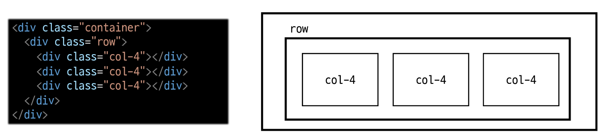
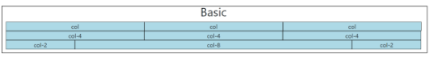
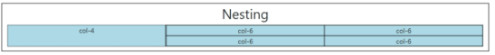
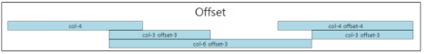
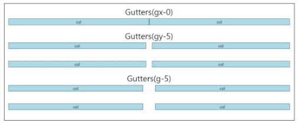
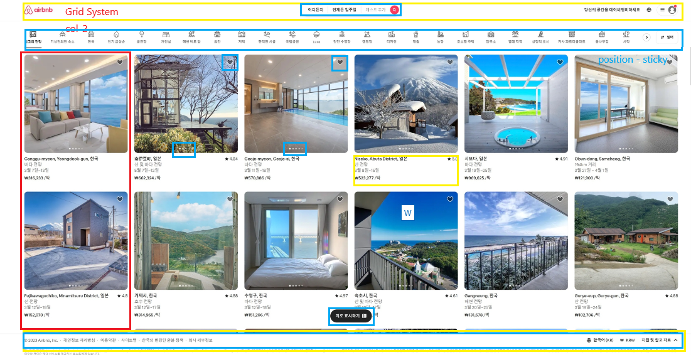

# Bootstrap Grid System
- 웹페이지의 레이아웃을 조정하는데 사용되는 12(레이아웃 배치 가짓수가 많은)개의 컬럼으로 구성된 시스템
## Grid system 목적
- **반응형 디자인**을 지원해 웹페이지를 모바일, 태블릿, 데스크탑 등 다양한 기기에서 적절하게 표시할 수 있도록 도움
## Grid system 기본 요소
1. Container : Column 들을 담고 있는 공간
2. Column : 실제 컨텐츠를 포함하는 부분
3. Gutter : 컬럼과 컬럼 사이의 여백 영역
- 1개의 row 안에 12개의 column 영역이 구성
- 각 요소는 12칸 중 몇개를 차지할 것인지 지정됨


## Basic

```HTML
<h2 class="text-center">Basic</h2>
<!-- 1. container 지정 -->
<div class="container">
  <!-- 2. row 지정 -> 한 행이 12칸임-->
  <div class="row">
    <!-- 3. 3칸으로 나눠주기 위해서는 각 칸 나누기 -->
    <!-- 숫자를 쓰지 않아도 동등하게 나눠줌 -->
    <div class="box col-4">col</div>
    <div class="box col-4">col</div>
    <div class="box col-4">col</div>
  </div>
  <div class="row">
    <div class="box col-4">col-4</div>
    <div class="box col-4">col-4</div>
    <div class="box col-4">col-4</div>
  </div>
  <div class="row">
    <!--  12칸이 넘어가면 다음 칸으로 넘어가짐 -->
    <div class="box col-2">col-2</div>
    <div class="box col-8">col-8</div>
    <div class="box col-2">col-2</div>
  </div>
</div>
```

## 중첩(Nesting)

```html
<!--  중첩 -> 12칸 안에 12칸 또 나눠짐 -->
<h2 class="text-center">Nesting</h2>
<!-- 1. 제일 큰  container -->
<div class="container">
  <div class="row">
    <!--2. 4 : 8 비율로 나누기 -->
    <div class="box col-4">col-4</div>
    <!--3. 8 비율칸을 반반으로 나누기 -->
    <div class="box col-8">
      <div class="row">
        <div class="box col-6">col-6</div>
        <div class="box col-6">col-6</div>
        <div class="box col-6">col-6</div>
        <div class="box col-6">col-6</div>
      </div>
    </div>
  </div>
</div>

```

## Offset(상쇄)
```HTML
<!-- offset 비워진 공간 -->
<h2 class="text-center">Offset</h2>
<!-- 1.container -->
<div class="container">
  <!-- 2. 한 행 -->
  <div class="row">
    <!-- 3. 양쪽 끝에 배치하고 싶음 -->
    <div class="box col-4">col-4</div>
    <!-- 3-1. 4칸 건너 뛰고 4칸 차지해 -->
    <div class="box col-4 offset-4">col-4 offset-4</div>
  </div>
  <div class="row">
    <!-- 항상 상쇄 한 다음 차지가 일어남 -->
    <div class="box col-3 offset-3">col-3 offset-3</div>
    <div class="box col-3 offset-3">col-3 offset-3</div>
  </div>
  <div class="row">
    <div class="box col-6 offset-3">col-6 offset-3</div>
  </div>
</div>
```


## Gutter
- grid system 에서 column 사이에 여백영역
- x축은 padding(전체 레이아웃 깨트리지 않기 위해), y축은 margin(레이아웃과 상관없어서)으로 여백 설정
- 그래서 x축은 간격을 늘리면 column 자체 크기가 줄어든다

```HTML
<h2 class="text-center">Gutters(gx-0)</h2>
<!-- container 지정 -->
<div class="container">
  <!-- row 지정 -->
  <!-- 컴럼간의 간격을 0으로 설정하여 여백 삭제 -->
  <div class="row gx-0">
    <!--  아까와 다르게 컬럼 안에 박스를 넣어서 여백이 존재 -->
    <div class="col-6">
      <div class="box">col</div>
    </div>
    <div class="col-6">
      <div class="box">col</div>
    </div>
  </div>
</div>

 <br>

 <h2 class="text-center">Gutters(gy-5)</h2>
<!-- container 지정 -->
<div class="container">
  <!-- row 지정 -->
  <!-- 컴럼간의 위아래 간격은 원래 0이기때문에 추가로 여백 설정 -->
  <div class="row gy-5">
    <div class="col-6">
      <div class="box">col</div>
    </div>
    <div class="col-6">
      <div class="box">col</div>
    </div>
    <div class="col-6">
      <div class="box">col</div>
    </div>
    <div class="col-6">
      <div class="box">col</div>
    </div>
  </div>
</div>

 <br>

 <h2 class="text-center">Gutters(gy-5)</h2>
<!-- container 지정 -->
<div class="container">
  <!-- row 지정 -->
  <!-- 컴럼간의 상하좌우 여백 설정 -->
  <div class="row g-5">
    <div class="col-6">
      <div class="box">col</div>
    </div>
    <div class="col-6">
      <div class="box">col</div>
    </div>
    <div class="col-6">
      <div class="box">col</div>
    </div>
    <div class="col-6">
      <div class="box">col</div>
    </div>
  </div>
</div>
```


---
# 반응형 웹
## Responsive Web Design
- 디바이스 종류나 화면 크기에 상관없이, 어디서든 일관된 레이아웃 및 사용자 경험을 제공하는 디자인 기술
- Bootstrap grid system에서는 12개 column과 6개의 breakpoints 를 사용하여 반응형 웹 디자인을 구현

## Grid system breakpoints
- 웹페이지를 다양한 화면 크기에서 적절하게 배치하기 위한 분기점
- 화면 너비에 따라 6개의 분기점 제공(xs, sm, md,lg,xl,xxl)
- 각 breakpoints 마다 설정된 최대 너비 값 이상으로 화면이 커지면 gridsystem 동작이 변경됨

|-| xs|  sm|  md| lg| xl| xxl |
|-|-|-|-|-|-|-|
|container(max width)|None|540px|720px|960px|1140px|1320px|
|class prefix|.col-|.col-sm-|.col-md-|.col-lg-|.col-xl-|.col-xxl-|

```HTML
<h2 class="text-center">Breakpoints</h2>
<div class="container">
  <div class="row">
    <!-- 제일 작을때는 12칸 을 한줄씩 모두 차지 -->
    <!-- sm 사이즈로 넘어감과 동시에 6칸으로 줄임 -->
    <!-- md 사이즈로 넘어감과 동시에 2칸, 8칸, 2칸으로 윗줄 차지하고 나머지는 밑의 한줄 12칸을 모두 가짐 -->
    <!-- lg 사이즈로 넘어감과 동시에 4칸, 4칸, 4칸으로 윗줄 차지하고 나머지는 밑의 한줄 12칸을 모두 가짐 -->
    <div class="box col-12 col-sm-6 col-md-2 col-lg-4">
      col
    </div>
    <div class="box col-12 col-sm-6 col-md-8 col-lg-4">
      col
    </div>
    <div class="box col-12 col-sm-6 col-md-2 col-lg-4">
      col
    </div>
    <div class="box col-12 col-sm-6 col-md-12 col-lg-12">
      col
    </div>
  </div>
  <hr>
  <h2 class="text-center">Breakpoints + offset</h2>
  <div class="row g-4">
    <div class="box col-12 col-sm-4 col-md-6">
      col
    </div>
    <div class="box col-12 col-sm-4 col-md-6">
      col
    </div>
    <div class="box col-12 col-sm-4 col-md-6">
      col
    </div>
    <!--  해당 사이즈에서 원하는 오프셋값을 가짐 -->
    <!--  다음사이즈에서 오프셋을 사용하고 싶지 않다면 0으로 해제가 필요함 -->
    <div class="box col-12 col-sm-4 offset-sm-4 col-md-6 offset-md-0">
      col
    </div>
  </div>
</div>
```

---
## 참고
### Grid cards
- row-cols사용
```HTML
<h2 class="text-center">Grid Cards</h2>
<div class="container">
  <!-- 제일 작을때는 1칸만 출력 sm이 되면 3칸으로 늘어나짐 -->
  <div class="row row-cols-1 row-cols-sm-3 row-cols-md-2">
    <div class="col">
      <div class="card">
        <div class="card-body">
          <h5 class="card-title">Card title</h5>
          <p class="card-text">This is a longer card with supporting text below as a natural lead-in to additional
            content. This content is a little bit longer.</p>
        </div>
      </div>
    </div>
    <div class="col">
      <div class="card">
        <div class="card-body">
          <h5 class="card-title">Card title</h5>
          <p class="card-text">This is a longer card with supporting text below as a natural lead-in to additional
            content. This content is a little bit longer.</p>
        </div>
      </div>
    </div>
    <div class="col">
      <div class="card">
        <div class="card-body">
          <h5 class="card-title">Card title</h5>
          <p class="card-text">This is a longer card with supporting text below as a natural lead-in to additional
            content.</p>
        </div>
      </div>
    </div>
    <!-- sm일때 맨 마지막줄 4칸 띄기 미디엄 사이즈일때는 offset 삭제 -->
    <div class="col offset-sm-4 offset-md-0">
      <div class="card">
        <div class="card-body">
          <h5 class="card-title">Card title</h5>
          <p class="card-text">This is a longer card with supporting text below as a natural lead-in to additional
            content. This content is a little bit longer.</p>
        </div>
      </div>
    </div>
  </div>
</div>
```