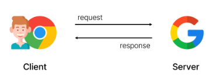
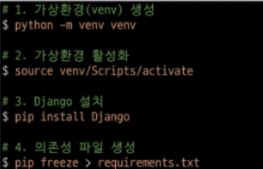
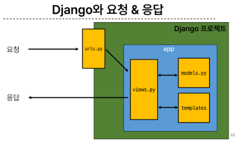

## 목차
- Django and Framework
  - Framework
  - Django framework
  - 클라이언트와 서버
  - Diango 프로젝트 및 가상환경
- Django Design Pattern
  - Django 프로젝트와 앱
  - Django 디자인 패턴
  - 요청과 응답
---
# Framework
- 웹 어플리케이션을 빠르게 개발할 수 있도록 도와주는 도구
- 기본적인 구조, 도구, 규칙등을 제공
- 여러 라이브러리를 제공해 개발속도를 빠르게 할 수 있음
- 유지보수와 확장에 용이해 소프트웨어의 품질을 높임

# Django
- 파이썬 기반의 대표적인 웹 프레임워크

---
## 웹의 동작 방식
- 우리가 컴퓨터 혹은 모바일 기기로 웹페이지를 보게 될 때까지 일어나는 일
- 클라이언트가 요청을 하면 서버가 응답을 줌

### 클라이언트
- 서비스를 요청하는 주체
- 웹 사용자의 인터넷이 연결된 장치, 웹 브라우저

### 서버
- 클라이언트의 요청에 응답하는 주체
- 웹 페이지, 앱을 저장하는 컴퓨터



---
# 프로젝트 및 가상환경
## 가상환경
- python 애플리케이션과 그에 따른 패키지들을 격리하여 관리할 수 있는 **독립적인** 실행환경
- 서로 다른 프로젝트가 다른 패키지를 사용해야 할 때 사용(지금까지 우리가 사용하던건 전역환경)

## 실습
1. 가상환경 만들기
  - `python -m venv ` + 가상환경 이름
2. 활성화
  - on/off(이동의 개념이 아님)
  - `source venv/Scripts/activate`
  - >tab으로 치면서 타자 치기(오타금지)
  - (venv) 가 붙어있으면 ON 상태임
  - 끄고 싶다면 `deactivate`
3. 환경에 있는 패키지 보기
  - `pip list`
4. 공유 프로젝트 할때 패키지 목록 공유하기 위해 텍스트 파일 생성
  - `pip freeze > requirements.txt` 
5. 한번에 패키지 다운받기
  - `pip install -r requirements.txt`

## 의존성 패키지
- 한 소프트 웨어 패키지가 다른 패키지의 기능이나 코드를 사용하기 때문에 그 패키지가 존재해야만 제대로 작동하는 관계

## Django 프로젝트 생성 전 루틴
1. 가상환경 생성
2. 가상환경 활성화
3. Django 설치
4. 의존성 파일 생성(패키지 설치시마다 진행)



### [django 공식문서](https://docs.djangoproject.com/ko/4.2/)

## Django  프로젝트 생성
1. `django-admin startproject firstpjt .`
2. `python manage.py runserver`
3.  http://127.0.0.1:8000/ ->ctrl 누르고 클릭해서 서버 접속
4. 서버 종료하기 -> ctrl + C

# 프로젝트 생성 루틴 정리 + git
> 1. 가상환경 생성
>   - `python -m venv venv`
> 2. 가상환경 활성화
>   - `source venv/Scripts/activate`
>   - 혹은 ctrl shift p -> interpreter -> 별
> 3. Django 설치
>   -> `pip install django`
> 4. 의존성 파일 생성
>   -> `pip freeze > requirements.txt`
> 5. .gitignore 파일생성
> 6. git 저장소 생성
> 7. Django 프로젝트 생성

## LTS
- 장기간 지원되는 안정적인 프레임워크
---
# Django 프로젝트와 앱
## Django project
- 애플리케이션의 집합(DB 설정, URL 연결, 전체 앱 설정 등을 처리)
## Django application
- 독립적으로 작동하는 기능 단위 모듈
- 각자 특정한 기능을 담당하며 다른 앱들과 함께 하나의 프로젝트를 구성

## 실습(순서 중요)
1. 앱 생성(복수형으로 지정하는것을 권장) ->`python manage.py startapp articles`
2. 앱 등록 ->
   - pjt의 settings.py에 들어가기 
   - INSTALLED_APPS에 추가하기(위쪽에)

---

# 디자인 패턴
- 소프트웨어 설계에서 발생하는 문제를 해결하기 위한 일반적인 해결책(공통적인 문제를 해결하는데 쓰이는 형식화된 관행)

## MVC 디자인 패턴(Model, View, Controller)
- 애플리케이션을 구조화하는 대표적인 패턴
- 데이터, 사용자 인터페이스, 비즈니스 로직을 분리
## MTV 디자인 패턴(Model, Template, View)
- MVC와 동일하나 명칭만 다르게 정의
- View -> Template
- Controller -> View

## 프로젝트 구조
- **settings.py**
  - 프로젝트의 모든 설정을 관리
- **urls.py**
  - URL과 이에 해당하는 적절한 views를 연결
- __init.py
  - 해당 폴더를 패키지로 인식하도록 설정(안건드림)
- asgi.py
  - 비동기식 웹 서버와의 연결 관련 설정
- wsgi.py
  - 웹 서버와의 연결 관련 설정
- manage.py
  - django프로젝트와 다양한 방법으로 상호작용하는 커맨드 라인 유틸리티

## 앱 구조
- **admin.py**
  - 관리자용 페이지 설정
- **models.py**
  - DB와 관련된 Model을 정의
  - MTV 패턴의 M
- **views.py**
  - HTTP 요청을 처리하고 해당 요청에 대한 응답을 반환(url,mode,template)
  - MTV 패턴의 V
- apps.py
  - 앱의 정보가 작성된 곳
- tests.py
  - 프로젝트 테스트 코드를 작성하는 곳

---
# 요청과 응답


## URLs
- path('admin/', admin.site.urls)
  - 서버 뒤에 admin/ 붙이면 관리자 로그인 홈페이지 나옴
- articles앱의 views에서 함수를 호출하기
  1. url에 import 
    - `from articles import views`
  2. views 에 함수 추가
    - ```
      def index(request):
      # 메인 페이지를 응답
      return render(request,'articles/index.html') # 템플릿
      ```
  3. templates 폴더 생성 -> articles 폴더 생성 -> index.html 생성
  4. url에 path 설정
    - `path('articles/',views.index)`

# 최종 순서
1. 가상환경 생성
    - `python -m venv venv`
2. 가상환경 활성화
    - `source venv/Scripts/activate`
    - 혹은 ctrl shift p -> interpreter -> 별
3. Django 설치
    -> `pip install django`
4. 의존성 파일 생성
    -> `pip freeze > requirements.txt`
5. 프로젝트 생성
    -> `django-admin startproject firstpjt .`
6. 서버 켜기
    -> `python manage.py runserver`
    -> http://127.0.0.1:8000/ ->ctrl 누르고 클릭해서 서버 접속
7. 서버 종료하기 -> ctrl + C
8. 앱 생성
    - `python manage.py startapp articles`
9.  앱 등록 
    - pjt의 settings.py에 들어가기 
    - INSTALLED_APPS에 추가하기(위쪽에)
    - ```py
      INSTALLED_APPS = [
      'articles',
      'django.contrib.admin',
      ...
      ]
      ```
10. articles앱의 views에서 함수를 호출하기
    1. firstpjt의 urls에 import
      - `from articles import views`
    2. path 생성
      - `path('articles/',views.index)`
11. 실행하기
    - `python manage.py runserver`
    - 뒤에 /articles 붙이기   