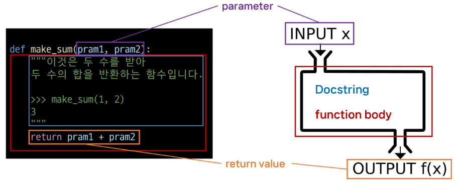
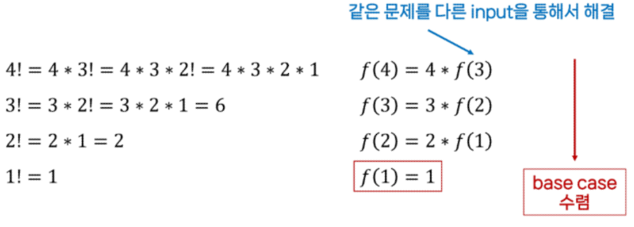
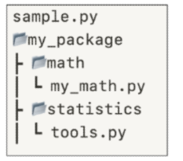

# Function

## 함수
- 특정 작업을 수행하기 위해 재사용 가능한 코드 묶음
- 사용 이유
  - 두수의 합을 구하는 함수를 정의하고 사용함으로써 **중복 방지**
  - 재사용성이 높아지고, 코드의 가독성과 유지보수성 향상
- 예시
  ```Python
  def get_sum(num1,num2):
      return num1 + num2
  sum_result = get_sum(num1,num2)
  ```


### 내장함수 (Built - in function)
- 파이썬이 기본적으로 제공하는 함수
- 별도의 import 없이 바로 사용 가능
- 내장함수 리스트 [python 공식문서][https://docs.python.org/3.9/library/functions.html]

### 함수 호출
- 함수를 실행하기 위해 함수의 이름을 사용하여 해당 함수의 코드블록을 실행하는 것

#### 구조
- 매개변수(parameter)
  - input
- Docstring
  - 함수에 대한 설명서(필수 X)
- Function body
  - 함수 구현
- Output
  - return 값으로 출력
  

#### 함수의 정의와 호출

- 함수 정의(정의) 

  - 함수 정의는 def 키워드로 시작 
  - def 키워드 이후 함수 이름 작성 
  - 괄호안에 매개변수를 정의할 수 있음 
  - 매개변수(parameter)는 함수에 전달되는 값을 나타냄

  ```py
  # 함수 정의
  def greet (name):
  '''입력된 이름 값에
  인사를 하는 메세지를 만드는 함수'''
  message = 'Hello,' + name
  return message
  
  # 함수 호출
  result = greet ('Alice')
  print(result)
  ```

- 함수 body 

  - 콜론(:) 다음에 들여쓰기 된 코드 블록 

  - 함수가 실행 될 때 수행되는 코드를 정의 

    ```py
    message = 'Hello,' + name
    return message
    ```

  - Docstring은 함수 body 앞에 선택적으로 작성 가능한 함수 설명서

    `'''입력된 이름 값에 인사를 하는 메세지를 만드는 함수'''`

- 함수 반환 값 

  - 함수는 필요한 경우 결과를 반환할 수 있음 

  - return 키워드 이후에 반환할 값을 명시 

  - return 문은 함수의 실행을 종료하고, 결과를 호출 부분으로 반환

    `return message`

- 함수 호출 

  - 함수를 호출하기 위해서는 함수의 이름과 필요한 인자(argument)를 전달해야 함 

  - 호출 부분에서 전달된 인자는 함수 정의 시 작성한 매개변수에 대입됨

  - return이 필요없는 대표적인 경우 print

  - 반환값이 없는 함수는 리턴값이 None

    `result = greet ('Alice')`
  
- **print vs return**

  ```py
  def add(a,b)
  	return a + b  #return값을 명시하지 않으면 NONE으로 인식
  a = print('hello')
  print(a)   #NONE
  #print는 return 값이 없음
  
  a = add(1,2)
  print(a)   #3
  ```

  

---
### 매개변수
| 매개변수                       | 인자                                |
| ------------------------------ | ----------------------------------- |
| parameter                      | argument                            |
| 함수를 정의할 때 들어가는 변수 | 실제 함수를 호출할 때 사용하는 변수 |
| 전달되는 변수                  | 정의하는 변수                       |

```python
def add_number(x,y): #x와 y는 매개변수
	result = x + y
    return result
a=2
b-3
sum_result = add_number(a,b)
print(sum_result)
```


#### 위치인자

- 함수 호출시 인자의 위치에 따라 전달되는 인자

- **위치인자는 함수호출시 반드시 값을 전달해야함**

  ```python
  def greet (name, age):
  	print(f'안녕하세요, {name}님! {age}살이시군요.')
  greet('Alice', 25) # 안녕하세요, Alice님! 25살이시군요.
  ```

  

#### 기본인자

- 함수 정의에서 매개변수에 기본 값을 할당하는 것

- 함수 호출시 인자를 전달하지 않으면, 기본값이 매개변수에 할당됨

  ```py
  def greet (name, age = 30):
  	print(f'안녕하세요, {name}님! {age}살이시군요. ')
  greet('Bob') # 안녕하세요, B0b님! 30살이시군요.
  greet ('Charlie',40) # 안녕하세요, Charlie님! 40살이시군요.
  ```

  

#### 키워드 인자

- 함수 호출시 이름과 함께 값을 전달

- 매개변수와 인자를 일치시키지 않고, 특정 매개변수에 값을 할당할 수 있음

- 인자의 **순서는 중요하지 않으며, 인자의 이름을 명시**하여 전달

- **단, 호출시 키워드 인자는 위치 인자 뒤에 위치해야 함**

  ```py
  def greeting(name,age):
      print(f'안녕,{name}.{age}!!')
  greeting('Alice',25) #안녕, Alice, 25!!
  greeting(25,'Alice') #안녕, 25, Alice!!
  greeting(age=25,name='Alice') #안녕, Alice, 25!!
  greeting(age=25,'Dave') #Error 키워드 인자는 위치 인자 뒤에 위치해야 함
  
  ```

#### Arbitrary Argument Lists(임의의 인자 목록)

- 정해지지 않은 개수의 인자를 처리하는 인자

- 함수 정의 시 매개변수 앞에 '*'를 붙여 사용하며, 여러개의 인자를 **tuple로 처리**

  ```py
  def cal(*args):
      print(args)	
  
  cal(1,2,3,4,5)		#(1,2,3,4,5) 튜플로 출력
  ```

  

#### Arbitrary Ketword Argument Lists(임의의 키워드 인자 목록)

- 정해지지 않은 개수의 키워드 인자를 처리하는 인자
- 함수 정의 시 매개변수 앞에 '*'를 붙여 사용하며, 여러개의 인자를 **dictionary 로 묶어 처리**

```py
def print_info(**kwargs):
    print(kwargs)	

print_info(name='Eve',age=30)	#{'name':'Eve','age':30} 딕셔너리로 출력
```


#### 함수 인자 권장 작성 순서

- 위치 -> 기본 -> 가변 -> 키워드 -> 가변 키워드

```py
def func(pos1,pos2,default_arg='default',*args,kwd,**kwargs):
```

- 꼭 지켜져야 하는 것은 아님(지켜져야 하는것은 에러가 남)

- 예시 : `print(*objects, sep=' ',end='\n', file=sys.stdout, flush=False)`
  - *object - 가변인자
  - sep=' ', end='\n', file=sys.stdout, flush=False - 기본인자

---

### 함수와 Scope


#### Python의 범위(Scope)

- 함수는 코드 내부에 local scope(지역)를 생성하며, 그 외의 공간인 global scope로 구분

- scope
  - **global scope** : 코드 어디에서든 참조할 수 있는 공간
  - **local scope** : 함수가 만든 scope (함수 내부에서만 참조 가능)
- variable
  - global variable : global scope에 정의된 변수
  - local variable : local scope에 정의된 변수


#### 변수 수명주기(lifecycle) 

- 변수의 수명주기는 변수가 선언되는 위치와 스코프에 따라 결정됨

1. built-in scope
   - 파이썬이 실행된 이후부터 영원히 유지
   - 파이썬 내장함수

2. global scope
   - 모듈이 호출된 시점 이후 혹은 인터프리터가 끝날 때까지 유지

3. local scope
   - 함수가 호출될 때 생성되고 함수가 종료될 때까지 유지

#### 이름 검색 규칙(Name Resolution) 

- 파이썬에서 사용되는 이름(식별자)들은 특정한 이름공간(namespace)에 저장되어 있음 
- 아래와 같은 순서로 이름을 찾아 나가며, LEGB Rule이라고 부름 

1. Local scope : 지역 범위(현재 작업 중인 범위)

2. Enclosed scope : 지역 범위 한 단계 위 범위

3. Global scope : 최상단에 위치한 범위

4. Built-in scope : 모든 것을 담고 있는 범위(정의하지 않고 사용할 수 있는 모든 것)

※ **함수 내에서는 바깥 Scope의 변수에 접근 가능하나 수정은 할 수 없음**


### LEGB Rule 예시

- 내장함수를 변수 이름으로 사용하면 안되는 이유

- 변수로 내장함수를 참조시 LEGB 법칙에 따라 global에서 먼저 찾기 때문에 built-in 까지 가지 않음

- 예시

  ```python
  print(sum([1,2,3])) #6
  sum = 5
  print(sum([1,2,3])) #Type error
  ```

  

```py
#영역 연습
a=1
b=2

def enclosed():
    a=10
    c=3
    
    def local(c):		#c 는 local 500을 호출
        print(a,b,c)	#10 2 500
        
    local(500)			#지역 안의 a와 c 호출 지역 안에 없는 b는 밖에서 호출
    print(a,b,c)		#10 2 3
    
enclosed()
print(a,b)				#1 2
```


### 'global' 키워드

- 변수의 스코프를 전역범위로 지정하기 위해 사용

- 알고리즘 풀이에서 공통된 변수를 여러 함수에서 수정해야 할 때 사용

- 일반적으로 함수 내에서 전역 변수를 수정하려는 경우에 사용

  ```py
  num = 0 
  def increment():
      global num
      num +=1
      
  print(num) #0
  increment()
  print(num) #1
  ```

- 주의사항
  - 매개변수에 global 사용 불가
  - global 키워드 선언 전에 접근 불가
- 긴 코드 내에서는 사용하지 않는걸 권장


---

### 재귀함수

- 함수 내부에서 자기 자신을 호출하는 함수

- 변수사용이 줄어들고 코드의 가독성이 높아짐

- 1개 이상의 base case(**종료되는 상황**) 이 존재하고, **수렴하도록 작성** (무한 호출 조심)

- 예시 (팩토리얼)

  

```py
def factorial(n):
    #종료조건:n=0이면 1을 반환
    if n == 0:
        return 1
    #재귀 호출: n과 n-1의 팩토리얼을 곱한 결과를 반환
    return n * factorial(n-1)
```


---

### 유용한 내장함수

#### map

- `map(function(함수), iterable(반복이 가능한 객체))`

- 순회 가능한 데이터 구조(문자열, 리스트 등등)의 모든 요소에 function을 적용해줌

- 반복문과 동일

- 가장 많이 쓰는 코드 `map(int,input().split())`

  ```py
  numbers = [1,2,3]
  result = map(str,numbers) #모든 numbers를 문자열로 바꿔줌
  
  print(result)		#<map object at 0x00001~~~
  print(list(result))	#['1','2','3']
  ```

- 장점 : 함수를 인자로 받을 수 있음(내가 쓴 함수도 가능)

- 여러개의 리스트를 받아서 딕셔너리화 하고 또 각각의 인자를 받아 리스트로 만들기

  `list(map(함수,list1,list2,list3))`

  **조건 : 만든 함수의 매개변수와 인자가 갯수가 동일해야 함**

### zip

- zip(*iterables)

- 같은 인덱스의 iterable을 묶어서 출력

- 임의의 iterable을 모아 튜플을 원소로 하는 zip object를 반환

  ```py
  girls = ['jane','ashley']
  boys = ['peter','jay']
  pair zip(girls,boys)
  
  print(pair)		#<zip object at 0x ~~~
  print(list(pair)) #[('jane','peter'),('ashley','jay')]
  ```

- 두개의 리스트를 딕셔너리로 변환할 수 도 있음

  ```python
  key = ['a','b','c']
  values = [1,2,3]
  my_dict = dict(zip(keys,values))
  print(my_dict) # {'a':1,'b':2,'c':2}
  ```


#### lambda

- 간단한 연산이나 함수를 한줄로 표현할 때 사용
- 일회성으로 쓰는 익명 함수
- 함수를 매개변수로 전달하는 경우에도 유용하게 활용

```python
#간단한 예시, 하지만 이렇게 함수명을 지정할 바에는  def로 하는게 나음
addition lambda x,y:x+y

result addition(3,5)
print(result)	#8
```

- map + lambda 일때 응용

```py
numbers=[1,2,3,4,5]
result = map(lambda x:x*2,numbers)
print(result) #[2,4,6,8,10]
```


## Swea 팁

```python
# tip 입력 받아오는 함수
import sys
sys.stdin = open('input.txt')
```


---


## Packing & Unpacking

### Packing

- 여러개의 값을 하나의 변수에 묶어서 담는 것

- 패킹 예시

  - 변수에 담긴 값들은 튜플(tuple)형태로 묶임

    ```python
    packed_values = 1,2,3,4,5
    print(packed_values)	#(1,2,3,4,5)
    ```

- *b는 남는 요소들을 리스트로 패킹하여 할당

  ```py
  numbers = [1,2,3,4,5]
  a,*b,c = numbers
  print(a)	#1
  print(b)	#[2,3,4]
  print(c)	#5
  ```

- print 함수에 임의의 가변인자를 작성할 수 있었던 이유

  - 가변인자를 받는 코드가 있어서 여러개의 인자를 바아서 하나의 묶음으로 출력할 수 있음

  - `print(*object,sep=' ',end='\n',file=sys.stdout,flush=False)`

  ```py
  print('hello')
  #hello
  print('you','need','python')
  #you need python
  ```

  

### Unpacking

- 패킹된 변수의 값을 개별적인 변수로 분리하여 할당하는 것

- 예시

  ```py
  packed_values = 1,2,3,4,5
  a,b,c,d,e = packed_values
  
  print(a,b,c,d,e) #1,2,3,4,5
  ```

- 값이 더 많은 경우 - Error too many value

- 변수가 더 많은 경우 - not enough value

- *를 활용한 언패킹

  ```py
  names = ['alice','jane','peter']
  print(*names)	#alice jane peter
  ```

- **를 활용한 언패팅 (딕셔너리 키-값 쌍을 함수의 키워드 인자로 언패킹)

  ```py
  def my_function(x,y,z):
      print(x,y,z)
      
  my_dict = {'x':1,'y':2,'z':3}
  my_function(**my_dict)	#1 2 3
  ```


#### *, ** 언패킹 연산자 정리

#### '*'

- 패킹 연산자로 사용될 때, 여러 개의 인자를 하나의 튜플로 묶는 역할 

- 언패킹 연산자로 사용될 때, 시퀀스나 반복 가능한 객체를 각각의 요소로 언패킹하여 함수의 인자로 전달

#### '**'

- 언패킹 연산자로 사용될 때, 딕셔너리의 키-값 쌍을 키워드 인자로 언패킹하여 함수의 인자로 전달하는 역할

---

## 모듈

- 한 파일로 묶인 변수와 함수의 모음
- 특정한 기능을 하는 코드가 작성된 파이썬 파일
- 모듈을 가져오기 위해서는 import 해와야 함
- 내장함수 help를 사용해 모듈에 무엇이 들어있는지 확인 가능 `help(math)`

- 예시 

  - python 의 math 모듈
  - 파이썬이 이리 작성해둔 수학 관련 변수와 함수가 작성된 모듈

  ```py
  import math
  #모듈명.변수명
  print(math.pi)	#3.141592...
  #모듈명.함수명
  print(math.sqrt(4))	#2.0	
  ```

- 또는 from을 사용해도 됨(권장하지는 않음)

  ```py
  from math import pi, sqrt
  #from으로 가져오면 모듈명을 안써도 됨
  print(pi)
  print(sqrt(4))
  ```

  - 주의사항 : 다른 모듈이 같은 이름의 함수를 제공할 경우 문제 발생

- 직접 정의한 모듈 사용하기
  1. 모듈 my_math.py 작성
  2. 두 수의 합을 구하는 add 함수작성
  3. my_math 모듈 import 후 add  함수 호출

```py
import my_math
print(my_math.add(1,2))
```

- 자주 쓰는 모듈 math, random


---

### 파이썬 표준 라이브러리

#### PSL  내부 패키지

- [파이썬 표준 라이브러리][https://docs.python.org/ko/3.9/library/index.html]

- 모듈이 모이면 패키지, 패키지가 모이면 라이브러리



- 패키지 3개 : my_package, math, statistics
- 모듈 2개 : my_math, tools

- import 방법

  ```py
  from my_package.math.my_math import my_math
  ```


#### 외부패키지

- **pip**를 사용하여 설치 후 import 필요

- [pip][https://pypi.org/]

- requests (가장 유명한 외부 패키지)

- terminal에 **`pip install requests`** 쓰면 설치됨

  ```python
  import requests
  requests.get(요청보낼 주소)
  ```

- 임의의 강아지 사진을 가져오는 예시

  ```py
  import requests
  response = requests.get('https://dog.ceo/api/breeds/image/random')
  print(response.json())
  ```

  

