# 배열 1(Array 1)
-  알고리즘
-  배열
-  버블 정렬 (Bubble Sort)
-  카운팅 정렬 (Counting Sort)
-  완전검색
-  그리디 (Greedy Algorithm)

## 알고리즘

-  (명) 알고리즘 : 유한한 단계를 통해 문제를 해결하기 위한 절차나 방법이다. 주로 컴퓨터용어로 쓰이며, 컴퓨터가 어떤 일을 수행하기 위한 단계적 방법을 말한다.
-  간단하게 다시 말하면 어떠한 문제를 해결하기 위한 절차라고 볼 수 있다.
-  예를 들어 1부터 100까지의 합을 구하는 문제를 생각해 보자.


-  컴퓨터 분야에서 알고리즘을 표현 하는 방법은 크게 두 가지
-  의사코드(**슈도코드**, Pseudocode)와 순서도
  - 의사코드 예
```python
Calcsum(n)
  sum # <-0
  for i : # 1 -> n 
    sum < sum + i 
  return sum;
```
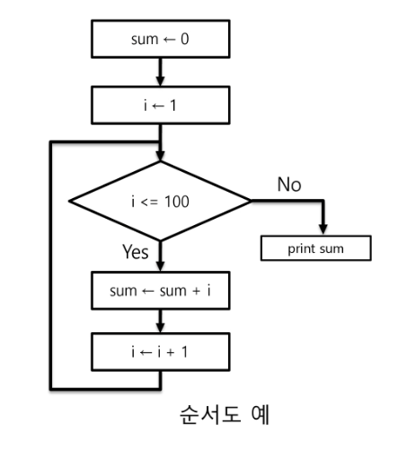

-  APS 과정의 목표 중의 하나는 보다 좋은 알고리즘을 이해하고 활용하는 것이다. 

### 무엇이 좋은 알고리즘인가?
  1.  정확성 : 얼마나 정확하게 동작하는가
  2.  작업량: 얼마나 적은 연산으로 원하는 결과를 얻어내는가
  3.  메모리 사용량: 얼마나 적은 메모리를 사용하는가
  4.  단순성 : 얼마나 단순한가
  5.  최적성 : 더 이상 개선할 여지없이 최적화되었는가

#### 주어진 문제를 해결하기 위해 여러 개의 다양한 알고리즘이 가능 + 어떤 알고리즘을 사용해야 하는가?
-  알고리즘의 성능 분석 필요
-  많은 문제에서 **성능 분석**의 기준으로 알고리즘의 작업량을 비교한다.
-  예 : 1부터 100까지 합을 구하는 문제

| 알고리즘 1 | 알고리즘 2 |
| --- | --- |
| 1+2+3+...+100 = 5050 | 100*(1+100)/2 = 5050|
| 100번의 연산 (덧셈 100번) | 3번의 연산 (덧셈 1번, 곱셈 1번, 나눗셈 1번) |

## 알고리즘의 성능은 무엇으로 측정하는가
- 알고리즘의 작업량을 표현할 때 시간복잡도로 표현한다.
- 시간 복잡도(Time Complexity)
    - 실제 걸리는 시간을 측정
    - 실행되는 명령문의 개수를 계산
- 알고리즘 1
```python
def CalcSum(n):
  sum = 0 # 1번
  for i in range (1, n+ 1) : # n번 
    sum + sum + i # n 
  return sum

```

     연산 횟수 : 1 + n * 2 = 2n + 1

- 알고리즘 2
```py
def CalcSum(n) :
  return n*(n+1)//2  #3 번
```
     연산 횟수 : 3번의 연산


## 알고리즘의 성능은 무엇으로 측정하는가

- 시간 복잡도 ≒ 빅-오(O) 표기법
    - 빅-오 표기법(Big-Oh Notation)
    - 시간 복잡도 함수 중에서 가장 큰 영향력을 주는 n에 대한 항만을 표시
    - 계수(Coefcent)는 생략하여 표시
    - 예를 들어
    - 
  

    - n개의 데이터를 입력 받아 저장한 후 각 데이터에 1씩 증가시킨 후 각 데이터를 화면에 출력하는 알고리즘의 시간복잡도는 어떻게 되나?
      - O(n)

### 다양한 시간 복잡도의 비교

-  요소 수가 증가함에 따라 각기 다른 시간복잡도의 알고리즘은 아래와 같은 연산 수를 보인다.
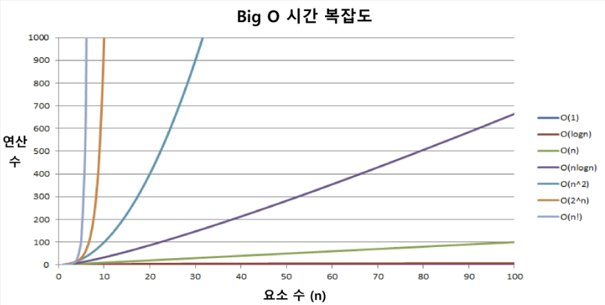


---

# 배열이란 무엇인가
- 인덱스로 접근하는 저장방식
- 일정한 자료형의 변수들을 하나의 이름으로 열거하여 사용하는 자료구조
- 아래의 예는 6개의 변수를 사용해야 하는 경우, 이를 배열로 바꾸어 사용하는 것이다.


### 배열의 필요성
- 프로그램 내에서 여러 개의 변수가 필요할 때, 일일이 다른 변수명을 이용하여 자료에 접근하는 것은 매우 비효율적일 수 있다.
- 배열을 사용하면 하나의 선언을 통해서 둘 이상의 변수를 선언할 수 있다.
-  단순히 다수의 변수 선언을 의미하는 것이 아니라, **다수의 변수로는 하기 힘든 작업을 배열을 활용해 쉽게** 할 수 있다.

### 1차원 배열
- 1차원 배열의 선언
  - 별도의 선언 방법이 없으면 변수에 처음 값을 할당할 때 생성
  - 이름 : 프로그램에서 사용할 배열의 이름
  - `Arr= list()`, `Arr = []` (1차원 배열 선언의 예)
  - `Arr= [1,2,3]`, `Arr = [0]* 10`
-  1차원 배열의 접근
  - `Arr[0] = 10` # 배열 Arr의 0번 원소에 10을 저장하라
-  `Arr[idx] = 20` # 배열 Ar의 idx번 원소에 20을 저장하라

- 배열 활용 예제 : Gravity
  - 상자들이 쌓여있는 방이 있다. 방이 오른쪽으로 90도 회전하여 상자들이 중력의 영향을 받아 낙하한다고 할 때, 낙차가 가장 큰 상자를 구하여 그 낙차를 리턴 하는 프로그램을 작성하시오.
  - 중력은 회전이 완료된 후 적용된다.
  - 상자들은 모두 한쪽 벽면에 붙여진 상태로 쌓여 2차원의 형태를 이루며
  벽에서 떨어져서 쌓인 상자는 없다.
  - 방의 가로길이는 항상 100이며, 세로 길이도 항상 100이다.
  - 즉, 상자는 최소 0, 최대 100 높이로 쌓을 수 있다.
연습 문제

- 그림 설명
  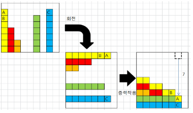
  - 아래 예) 총 26개의 상자가 회전 후, 오른쪽 방 그림의 상태가 된다. A 상자의 낙차가
  7로 가장 크므로 7을 리턴하면 된다.
  - 회전 결과, B상자의 낙차는 6, C상자의 낙차는 1이다.
  - 사실상 배열의 인덱스가 본인 이상일때 본인과 같거나 큰 요소의 개수를 찾는 문제


## 알고리즘 팁
```py
# 형식
T = int(input())
for tc in range(1, T + 1):
    N = int(input())
    arr = list(map(int, input().split()))
    ans = 0
    """
    내 코드

    """
    print(f'#{tc} {ans}')
```
---
## 정렬

- 2개 이상의 자료를 특정 기준에 의해 작은 값부터 큰 값(오름차순 : ascending), 혹은 그 반대의 순서대로(내림차순 : descendling) 재배열하는 것
- 키
  - 자료를 정렬하는 기준이 되는 특정 값
  

### 정렬의 종류
- 대표적인 정렬 방식의 종류
  - 버블 정렬 (Bubble Sort)
  - 카운팅 정렬 (Counting Sor)
  - 선택 정렬 (Selection Sort)
  - 퀵 정렬 (Quick Sort)
  - 삽입 정렬 (Insertion Sort)
  - 병합 정렬 (Merge Sort)
- APS 과정을 통해 자료구조와 알고리즘을 학습하면서 다양한 형태의 정렬을 학습하게 된다.

## 버블 정렬 (Bubble Sort)
- **인접한 두 개의 원소**를 비교하며 자리를 계속 교환하는 방식

- 정렬 과정

  - 첫 번째 원소부터 인접한 원소끼리 제속 자리를 교환하면서 맨 마지막
자리까지 이동한다.
  - 한 단계가 끝나면 가장 큰 원소가 마지막 자리로 정렬된다. ( 오름차순인 경우 )
  - 교환하며 자리를 이동하는 모습이 물 위에 올라오는 거품 모양과 같다고 하여 버블 정렬이라고 한다.
-  시간 복잡도
   - O(n^2)

## [55, 7, 78, 12, 42] 를 버블 정렬하는 과정 (오름차순)
- `i:N-1 -> 1 `
- `j:0 -> i-1`
- `if A[j]>A[j+1]`
- `A[j]<->A[j+1]`
- 첫 번째 패스
- 각 인접한 값에서 큰 값이 오른쪽으로 감
- j:0 -> i-1 ( 맨끝에 있는 원소는 정렬이 완료됨)
- i:N-1 -> i-1
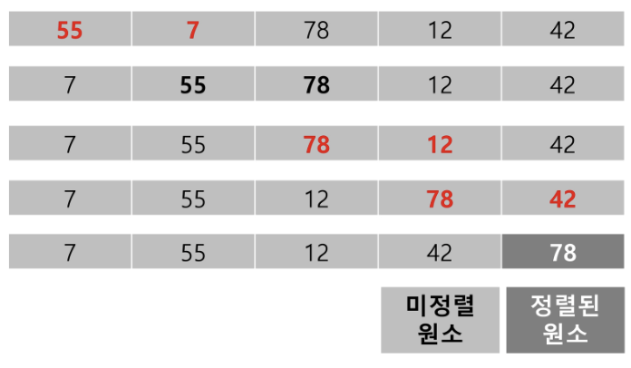
- 두 번째 패스
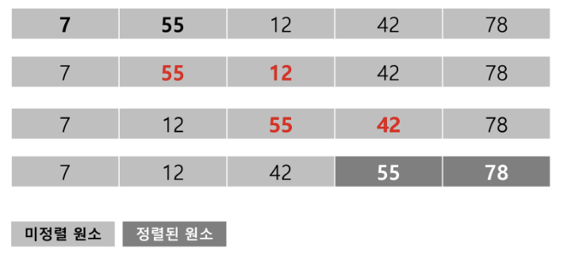
- 세 번째 패스
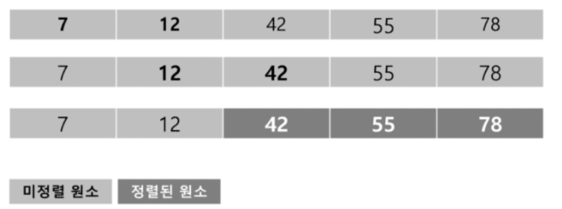
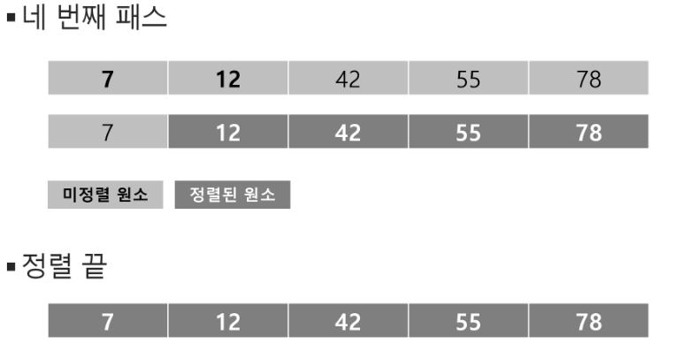


### 배열을 활용한 버블 정렬
-  앞서 살펴 본 정렬 과정을 코드로 구현하면 아래와 같다. (오름차순)


- Bubblesort(a, N)      # 정렬할 배열과 배열의 크기
-   for 1 : N-1 -> 1    # 정렬될 구간의 끝
-     for j : 0 -> j-1  # 비교할 원소 중 왼쪽 원소의 인덱스
-       if a[j] > a[j+1]  # 왼쪽 원소가 더 크면
-         a[j] <-> a[j+1] # 오른쪽 원소와 교환


```py
def Bubblesort(a, N) : # 정렬할 List, N 원소 수 
  for i in range(N-1, 0, -1) : # 범위의 끝 위치
    for j in range(0, i) :
      if a[j] > a[j+1]:
        a[j], a[j+1] = a[j+1], a[j]
```
---

## 카운팅 정렬(Counting Sort)

- 항목들의 순서를 결정하기 위해 집합에 각 항목이 몇 개씩 있는지 세는 작업을 하여, 선형 시간에 정렬하는 **효율적인** 알고리즘

- 제한 사항
  - **정수나 정수로 표현할 수 있는 자료에 대해서만 적용** 가능 : 각 항목의 발생 회수를 기록하기 위해, 정수 항목으로 인덱스 되는 카운트들의 배열을 사용하기 때문이다.
  - 카운트들을 위한 충분한 공간을 할당하려면 집합 내의 가장 큰 정수를 알아야 한다.
- 시간 복잡도
  - O(n + K) : n은 리스트 길이, K는 정수의 최대값

## 카운팅 정렬 과정 
- [0, 4, 1, 3, 1, 2, 4, 1] 을 카운팅 정렬하는 과정
- 1단계
  - Data에서 각 항목들의 등장 회수를 세고, 정수 항목들로 직접 인덱스 되는 카운트 배열 counts에 저장한다.
  - (카운트 리스트는 주어진 데이터의 범위)
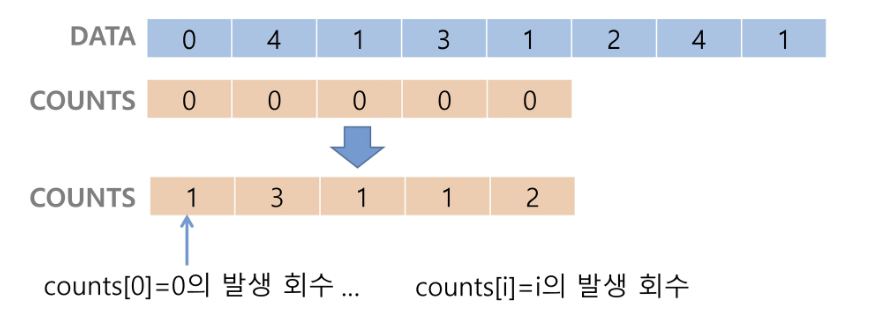


  - 정렬된 집합에서 각 항목의 앞에 위치할 항목의 개수를 반영하기 위해 counts의 원소를 조정한다.(누적형으로 변경)
  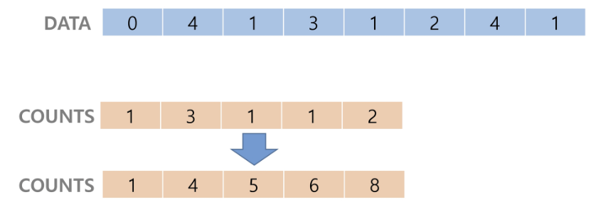
  - 슈도코드
    - for i : 1 -> 4
    - counts[i] += counts[i-1]


  - counts[1]을 감소시키고 Temp에 1을 삽입한다.
  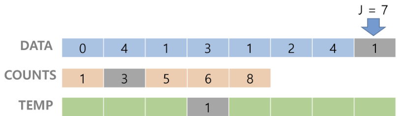
  - 슈도 코드
    - for j: N-1 -> 0 # 마지막 원소부터 처음으로
    - counts[DATA[j]] -= 1  # 카운트를 통해 자리를 찾아간 뒤 카운트 하나 줄임
  
  - counts[4]를 감소시키고 temp에 4를 삽입한다.
  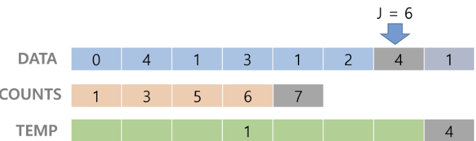
  -  counts[2]를 감소시키고 temp에 2를 삽입한다.-  
  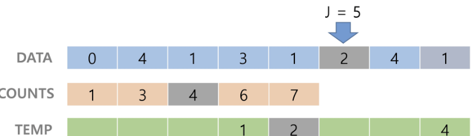
  -  counts[1]을 감소시키고 temp에 1을 삽입한다.
  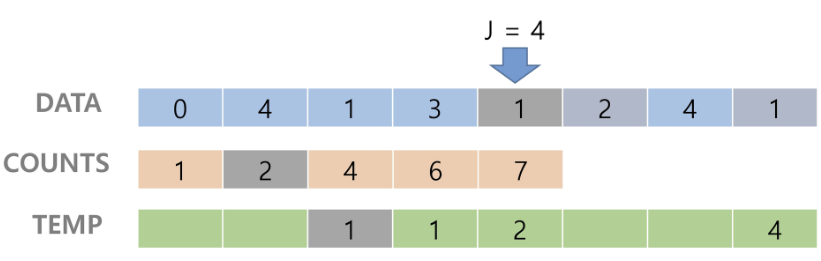
  - counts[3]을 감소시키고 temp에 3을 삽입한다.
  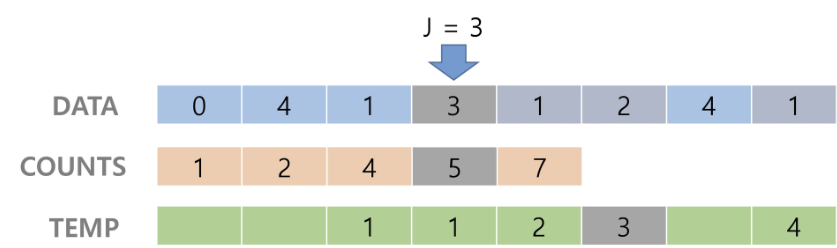
  - counts[1]을 감소시키고 temp에 1을 삽입한다.

  - counts[4]를 감소시키고 temp에 4를 삽입한다.
  - counts[0]를 감소시키고 temp에 0을 삽입한다.
- Temp 업데이트 완료하고 정렬 작업을 종료한다.

카운팅 정렬 알고리즘
```py
def Counting_Sort (A, B, k)

# A [] . 입력 배열(0 to k) - DATA
# B [] -- 정렬된 배열. -> TEMP
# C [] -- 카운트 배열. -> COUNTS

    C= [0] * (k+1)

    for i in range (0, len (A)):
        C[A[i]] += 1 # 카운트

    for i in range (1, len (C)):
        C[i] += C[i-1] # 누적

    for i in range (len(B)-1, -1, -1):
        C[A[i]] -= 1   # 원본의 마지막원소부터 가져옴
        B[C[A[i]]] = A[i] # 카운트 자리에 해당하는 인덱스에 가져다놓기

```
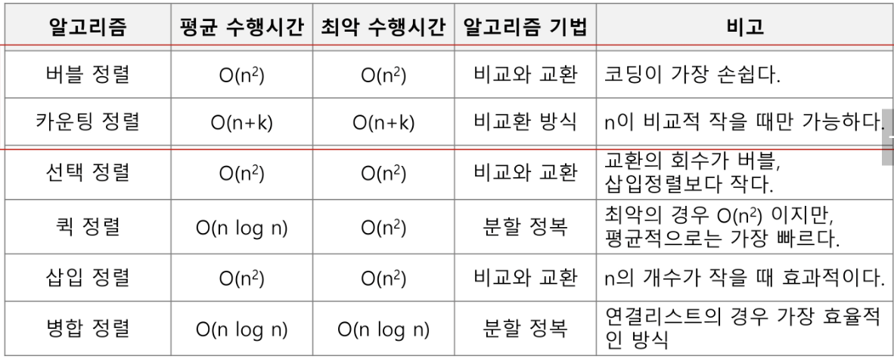
---

## Baby-gin Game
- 설명
  - 0~9 사이의 숫자 카드에서 임의의 카드 6장을 뽑았을 때, **3장의 카드가 연속적인 번호를 갖는 경우를 run이라 하고, 3장의 카드가 동일한 번호를 갖는 경우를 triplet**이라고 한다.
  - 그리고, 6장의 카드가 run과 triplet로만 구성된 경우를 baby-gin으로 부른다.
  - 6자리의 숫자를 입력 받아 baby-gin 여부를 판단하는 프로그램을 작성하라.


- 입력 예
  - 667767은 두 개의 tiplet이므로 baby-gin이다. (666, 777)
  - 054060은 한 개의 run과 한개의 triplet이므로 역시 baby-gin이다(456, 000)
  - 101123은 한 개의 triplet가 존재하나, 023이 run이 아니므로 baby-gin 이 아니다.
(123을 nun으로 사용하더라도 011이 run이나 triplet가 아님)

- 6자리의 숫자를 입력 받아 어떻게 Baby gin 여부를 찾을 것인가?

### 완전 검색
- 완전 검색 방법은 문제의 해법으로 **생각할 수 있는 모든 경우의 수를 나열**해보고
확인하는 기법이다.
- Brute-force 혹은 generate-and-test 기법이라고도 불리 운다.
- 모든 경우의 수를 테스트한 후, 최종 해법을 도출한다.
- 일반적으로 경우의 수가 상대적으로 작을 때 유용하다.

### 완전 검색으로 시작하라
- 모든 경우의 수를 생성하고 테스트하기 때문에 수행 속도는 느리지만, 해답을 찾아내지 못할 확률이 작다.
- 자격검정평가 등에서 주어진 문제를 풀 때, 우선 완전 검색으로 접근 도출한 후, 성능 개선을 위해 다른 알고리즘을 사용하고 해답을 확인 바람직하다.

### 완전 검색을 활용한 baby - gin 접근
- 고려할 수 있는 모든 경우의 수 생성하기
  - 6개의 숫자로 만들 수 있는 모든 숫자 나열 (중복 포함)
  - 예) 입력으로 [2,3,5,7,7]을 받았을 경우, 아래와 같이 순열을 생성할 수 있다.
  
2 3 5 7 7 7
2 3 7 5 7 7
2 3 7 7 5 7
  . . . 
7 7 7 5 3 2 <모든 경우의 순열 나열>

- 해답 테스트하기
  - 앞의 3자리와 뒤의 3자리를 잘라, nun와 tiplet 여부를 테스트하고 최종적으로 baby gin을 판단한다.
- 예) 235 -> 해당없음 777 -> triplete # baby-gin 아님!!

### 순열을 어떻게 생성할 것인가 
- 순열 (Permutation)
  - 서로 다른 것들 중 몇 개를 뽑아서 한 줄로 나열하는 것
  - 서로 다른 n개 중 개를 택하는 순열은 아래와 같이 표현한다.
  `nPr`
  - 그리고 nPr은 다음과 같은 식이 성립한다.
  `nPr= n* (n-1) * (1-2) *... * (n-r+1)`
  - nPn = **n!**이라고 표기하며 **Factorial**이라 부른다.
  `n! = n * (n-1) * (n -2) * 2 * 1`

#### 단순하게 순열을 생성하는 방법
- (예) (1,2,3)을 포함하는 모든 순열을 생성하는 함수
  - 동일한 숫자가 포함되지 않았을 때, 각 자리 수 별로 loop을 이용해 아래도 구현할 수 있다.

```py
for i1 in range(1, 4):
  for i2 in range(1, 4):
    if i2 != i1:
      for i3 in range (1, 4):
        if 13 != i1 and i3 != i2 :
          print(i1, i2, i3)
```

--- 

## 탐욕(Greedy) 알고리즘
- 탐욕 알고리즘은 최적해를 구하는 데 사용되는 근시안적인 방법
- 여러 경우 중 하나를 결정해야 할 때마다 그 순간에 최적이라고 생각
선택해 나가는 방식으로 진행하여 최종적인 해답에 도달한다.
- 각 선택의 시점에서 이루어지는 결정은 지역적으로는 최적이지만, 그 선택들을 계속 수집하여 최종적인 해답을 만들었다고 하여, 그것이 보장은 없다.
- 일반적으로, 머릿속에 떠오르는 생각을 검증 없이 바로 구현하면 Greedy 접근이 된다

## 탐욕 알고리즘의 동작과정
  1. 해 선택 : 현재 상태에서 부분 문제의 최적 해를 구한 뒤, 이를 부분해 집합(Solution Set)에 추가한다.
  1. 실행 가능성 검사 : 새로운 부분해 집합이 실행 가능한지를 확인한다.
곧, 문제의 제약 조건을 위반하지 않는지를 검사한다.
  1. 해 검사 : 새로운 부분해 집합이 문제의 해가 되는지를 확인한다.
아직 전체 문제의 해가 완성되지 않았다면 (1)의 해 선택부터 다시 시작한다.

#### 탐욕 알고리즘의 예
- 거스름돈 줄이기
  - “어떻게 하면 손님에게 거스름돈으로 주는 지폐와 동전의 개수를 최소한으로 줄일 수 있을까?

  1. 해 선택 : 여기에서는 멀리 내다볼 것 없이 가장 좋은 해를 선택한다. 단위가 큰 동전으로만 거스름돈을 만들면 동전의 개수가 줄어들므로 현재 고를 수 있는 가장 단위가 큰 동전을 하나 골라 거스름돈에 추가한다.

  1. 실행 가능성 검사 : 거스름돈이 손님에게 내드려야 할 액수를 초과하는지 확인한다. 초과한다면 마지막에 추가한 동전을 거스름돈에서 빼고, (1)로 돌아가서 현재보다 한 단계 작은 단위의 동전을 추가한다.

  1. 해 검사 : 거스름돈 문제의 해는 당연히 거스름돈이 손님에게 내드려야 하는 액수와 일치하는 셈이다. 더 드려도, 덜 드려도 안되기 때문에 거스름돈을 확인해서 액수에 모자라면 다시 (1)로 돌아가서 거스름돈에 추가할 동전을 고른다.

-  Baby gin을 완전검색 아닌 방법으로 풀어보자.
   - 6개의 숫자는 6자리의 정수 값으로 입력된다.
   - counts 배열의 각 원소를 체크하여 run과 tiplet 및 baby-gin 여부를 판단한다.


```py
num = 456789  # Baby Gin 확인할 6자리 수
c = [0] * 12 # 6자리 수 로부터 각 자리수를 추출하여 개수를 누적할 리스트
# 트리플릿을 9 까지 검사하고 싶기때문에

for i in range(6):
  c[num % 10] += 1
  num //= 10

```

- triplet을 먼저 조사해야함 (우선 계산)

```py

i = 0
tri = run = 0
while 1 < 10 :
    if c[i] >= 3 : # triplete 조사 후 데이터 삭제
        c[i] -= 3
        tri += 1 
        continue
    if c[1] >= 1 and c[i+1] >= 1 and c[i+2] > 1 :  # run 조사 후 데이터 삭제
        c[i] -= 1
        c[i+1] -= 1
        c[i+2] -= 1

        run += 1 
        continue
    i += 1

if run + tri == 2: 
    print("Baby Gin")
else: 
    print ("Lose")
```

- 입력받은 숫자를 정렬한 후, 앞뒤 3자리씩 끓어서 run 및 triplet을 확인하는 방법을 고려할 수도 있다.
  - 예) [6,4,4,5,4,4]
    - 정렬하여 [4,4,4,4,5,6] 을 얻어내면 쉽게 baby gin을 확인할 수 있다.

  - 예) [1,2,3,1,2,3]
-  정렬하면 [1,1,2,2,3,3]로서, 오히려 baby gin 확인을 실패할 수 있다.

-  위의 예처럼, 탐욕 알고리즘적인 접근은 해답을 찾아내지 못하는 경우도 있으니 유의해야 한다.