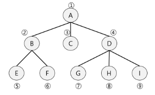
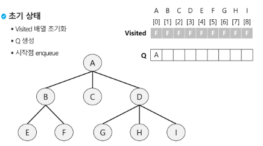
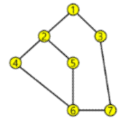

# Queue(큐)
- 선형 
- 원형큐
- 우선순위 큐
- 큐의 활용 : 버퍼
- BFS
- BFS 예제


## 큐(Queue)의 특성
- 스택과 마찬가지로 삽입과 삭제의 위치가 제한적인 자료구조
- 큐의 뒤에서는 삽입만 하고, 큐의 앞에서는 삭제만 이루어지는 구조
- **선입선출구조**(FIFO : First In First Out)
- 큐에 삽입한 순서대로 원소가 저장되어, 가장 먼저 삽입(First In)된 원소는 가장 먼저 삭제(First Out)된다.
- 퇴장 (삭제) <- 입장 (삽입)
  - 큐의 예: 서비스 대기행렬

## 큐의 선입 선출 구조


- 큐의 기본 연산
  - 삽입 : enQueue
  - 삭제 : deQueue

- 큐의 사용을 위해 필요한 주요 연산은 다음과 같음

## 큐의 주요 연산
| 연산 | 기능 |
| - | -------------------|
| enQueue(item) | 큐의 뒤쪽(rear 다음)에 원소를 삽입하는 연산 |
| deQueue() | 큐의 앞쪽(front)에서 원소를 삭제하고 반환하는 연산 |
| createQueue() | 공백 상태의 큐를 생성하는 연산 |
| isEmpty() | 큐가 공백상태인지를 확인하는 연산 |
| isFull() | 큐가 포화상태인지를 확인하는 연산 |
| Qpeek() | 큐의 앞쪽(front)에서 원소를 삭제 없이 반환하는 연산 |

### 큐의 연산과정
- (1) 공백 큐 생성 : createQueue(); 
  ```
   Q = [0]*100
   front = -1
   rear = -1
   같은의미 -> Q = []
  ```
- (2) 원소 A 삽입 : enQueue(A);
  ```
   rear += 1
   Q[rear] = A
   같은의미 -> Q.append(A)
  ```
- (3) 원소 B 삽입: enQueue(B);
 
  

- (4) 원소 반환/삭제 : deQueuel;
    ```
    front += 1
    top = Q[front]
    같은의미 -> Q.pop(0)
    ```
- (5) 원소 C 삽입: enQueue(C);
    ```
    rear += 1
    Q[rear] = C
    같은 의미 -> Q.append(C)
    ```
- (6) 원소 반환/삭제 : deQueuel;
    ```
    front += 1
    top = Q[front]
    같은의미 -> Q.pop(0)
    ```
- (7) 원소 반환/삭제 : deQueuel;
    - front == rear(같아지는 상황 맨 처음 큐 만들때와 끝날때)


### 큐의 구현
- 선형큐
  - 1차원 배열을 이용한 큐
    - 큐의 크기 = 배열의 크기
    - front 저장된 첫 번째 원소의 인덱스
    - rear: 저장된 마지막 원소의 인덱스
- 상태 표현

  - 초기 상태 : front = rear =-1
  - 공백 상태 : front ==rear
  - 포화 상태 : rear == n-1 (n : 배열의 크기, n - 1 : 배열의 마지막 인덱스)
- 초기 공백 큐 생성
  - 크기 n인 1차원 배열 생성
  - front와 rear를 1로 초기화

#### 삽입 : enQueue(item)
- 마지막 원소 뒤에 새로운 원소를 삽입하기 위해
(1) rear 값을 하나 증가시켜 새로운 원소를 삽입할 자리를 마련
(2) 그 인덱스에 해당하는 배열원소 Q[rear]에 item을 저장
```
def enQueue(item):
  global rear
  if isFull() : print("Queue_Full")
  else:
    rear <- rear + 1;
    Q[rear] <- item;
```
### 큐의 구현
#### 삭제 : deQueue0
- 가장 앞에 있는 원소를 삭제하기 위해
  - (1) front 값을 하나 증가시켜 큐에 남아있게 될 첫 번째 원소 이동
  - (2) 새로운 첫 번째 원소를 리턴 함으로써 삭제와 동일한 기능함
```
deQueue ( )
  if(isEmpty ()) then Queue_Empty();
  else{
    front < - front + 1;
    return [front];
  }
```

- 공백상태 및 포화상태 검사 : `isEmpty(), isFull()`
- 공백상태 : `front == rear`
- 포화상태 : `rear == n-1` (n : 배열의 크기, m1 : 배열의 마지막 인덱스)

```
def isEmpty() :
  return front == rear

def Full(:)
  return rear == len (Q) -1
```
#### 검색 : Qpeek0
- 가장 앞에 있는 원소를 검색하여 반환하는 연산
- 현재 front의 한자리 뒤(front+1)에 있는 원소, 즉 큐의 첫 번째에 있는 원소를 반환

```
def Qpeek () :
  if isEmpty() : print("Queue_Empty")
  else : return [front+1]
```

- 큐를 구현하여 다음 동작을 확인해 봅시다.
- 세 개의 데이터 1, 2, 3을 차례로 큐에 삽입하고
- 큐에서 세 개의 데이터를 차례로 꺼내서 출력한다.
    - 1, 2, 3 출력 되야 함.


---
## 선형 큐 이용시의 문제점

### 잘못된 포화상태 인식
- 선형 큐를 이용하여 원소의 삽입과 삭제를 계속할 경우, 배열의 앞부분에 활용할 수 있는 공간이 있음에도 불구하고, rear=n-1 인 상태 즉, 포화상태로 인식하여 더 이상의 삽입을 수행하지 않게 됨
1. 해결방법 1
- 매 연산이 이루어질 때마다 저장된 원소들을 배열의 앞부분으로 모두 이동시킴
- 원소 이동에 많은 시간이 소요되어 큐의 효율성이 급격히 떨어짐

<큐의 원소들을 이동>
2. 해결방법 2
- 1차원 배열을 사용하되, 논리적으로는 배열의 처음과 끝이 연결되어 원형 형태의 큐를 이룬다고 가정하고 사용
- 원형 큐의 논리적 구조


- 초기 공백 상태
- front = rear = 0
- Index의 순환
  - front와 rear의 위치가 배열의 마지막 인덱스인 n-1를 가리킨 후, 그 다음에는 논리적 순환을 이루어 배열의 처음 인덱스인 0으로 이동해야 함
  - 이를 위해 나머지 연산자 mod를 사용함
  - > (rear + 1) % 4
- front 변수
  - 공백 상태와 포화 상태 구분을 쉽게 하기 위해 front가 있는 자리는 사용하지 않고 항상 빈자리로 둠

- 삽입 위치 및 삭제 위치
  | | 삽입 위치 | 삭제 위치 |
  | - | - | - |
  | 선형큐  | rear = rear + 1 | front = front + 1 |
  | 원형큐  | rear = (rear + 1) mod n | front = (front + 1) mod n |


```
원형 큐의 구조
def enq(data):
    global rear
    global front
    # deq를 수행하지 않으면 꽉차기는 매한가지
    # 꽉차지 않으려면 덮어쓰면 되는데 이러면 deq 수행할때 나중에 들어온게 나올수도
    if (rear + 1) % cQsize == front:
        #  꽉찼을때 가장 먼저 있는 데이터 지우고 다 땡겨줘야 함 -> front를 밀기!
        front = (front + 1) % cQsize
    rear = (rear + 1) % cQsize
    cQ[rear] = data


def deq():
    global front
    front = (front+1) % cQsize
    return cQ[front]


cQsize = 4
cQ = [0] * cQsize
front = 0
rear = 0
```
### 원형큐의 연산과정
1. create Queue ( 4칸 짜리 )
   - front == rear -> 0
2. enQueue(A):
   - front -> 0  rear -> 1
3. enQueue(B):
   - front -> 0  rear -> 2
4. deQueue():
   - front -> 1  rear -> 2
5. enQueue(C):
   - front -> 1  rear -> 3
6. enQueue(D):
   - Queue는 Full, rear는 0으로 돌아옴
   - front -> 1  rear -> 0


- 초기 공백 큐 생성
  - 크기 n인 1차원 배열 생성
  - front와 rear를 0으로 초기화
- 공백상태 및 포화상태 검사 : isEmpty(), isFull()
  - 공백상태 : front == rear

  - 포화상태 : 삽입할 rear의 다음 위치 == 현재 front
    - (rear + 1) mod n == front
```
def isEmpty():
  return front == rear
def isFull()
  return (rear+1) % len (cQ) == front
```
# 원형큐의 구현
### 삽입: enQueue(item)
- 마지막 원소 뒤에 새로운 원소를 삽입하기 위해
(1) rear 값을 조정하여 새로운 원소를 삽입할 자리를 마련함:
rear <- (rear + 1) mod n;
(2) 그 인덱스에 해당하는 배열원소 cQ[rear]에 item을 저장
```
def enQueue(item) :
  global rear 
  if isFull() :
    print("Queue_Full")
  else:
    rear = (rear + 1) % len(cQ)
    cQ[rear] = item
```
### 삭제 : deQueue0, deletel
- 가장 앞에 있는 원소를 삭제하기 위해
(1) font 값을 조정하여 삭제할 자리를 준비함
② 새로운 front 원소를 리턴 함으로써 삭제와 동일한 기능함
```
def deQueue () :
global front if isEmpty () :
print("Queue_Empty")
else:
front = (front + 1) % len (cQ)
return cQ[front]
def isEmpty() :
return front == rear
def isFull() :
return (rear+1) % len(cQ) == front
```
---
# 우선순위 큐
- 우선순위 큐의 특성
  - 우선순위를 가진 항목들을 저장하는 큐
  - FIFO 순서가 아니라 우선순위가 높은 순서대로 먼저 나가게 된다.
- 우선순위 큐의 적용 분야
  - 시뮬레이션 시스템
  - 네트워크 트래픽 제어
  - 운영체제의 테스크 스케줄링

- 우선순위 큐의 구현
  - 배열을 이용한 우선순위 큐
  - 리스트를 이용한 우선순위 큐
- 우선순위 큐의 기본 연산
  - 삽입 : enQueue
  - 삭제 : deQueue


### 배열을 이용한 우선순위 큐
- 배열을 이용하여 우선순위 큐 구현
  - 배열을 이용하여 자료 저장
  - 원소를 삽입하는 과정에서 우선순위를 비교하여 적절한 위치에 삽입하는
  구조
  - 가장 앞에 최고 우선순위의 원소가 위치하게 됨
- 문제점
  - 배열을 사용하므로, 삽입이나 삭제 연산이 일어날 때 원소의 재배치가 발생함
  - 이에 소요되는 시간이나 메모리 낭비가 큼

---

## 버퍼
- 데이터를 한 곳에서 다른 한 곳으로 전송하는 동안 일시적으로 그 데이터를 보관하는 메모리의 영역
- 버퍼링 : 버퍼를 활용하는 방식 또는 버퍼를 채우는 동작을 의미한다.
- 버퍼의 자료 구조
  - 버퍼는 일반적으로 입출력 및 네트워크와 관련된 기능에서 이용된다.
  - 순서대로 입력/출력/전달되어야 하므로 FIFO 방식의 자료구조인 큐가 활용된다.

### 마이쮸 나눠주기 시뮬
1. 1번이 줄을 선다, 1번이 한개의 마이쮸를 받는다
2. 1번이 다시 줄을선다, 새로 2번이 들어와 줄을 선다
3. 1번이 두개의 마이쮸를 받는다, 1번이 다시 줄을 선다, 새로 3번이 들어와 줄을선다
4. 2번이 한개의 마이쮸를 받는다, 2번이 다시 줄을 선다, 새로 4번이 들어와 줄을 선다
5. 1번이 세개의 마이쮸를 받는다, 1번이 다시 줄을 선다, 새로 5번이 들어와 줄을 선다
6. ...
7. 20개의 마이쮸가 있을때 마지막 것을 누가 가져갈까?
#### 팁 -> 마이쮸의 개수대로 큐를 만들면 다 찰일이 없음
---
### 추가

```
from collections import deque
# deque는 속도가 빠름
q = deque()
q.append(1)
q.append(2)
q.append(3)
print(q.popleft())
print(q.popleft())
print(q.popleft())

```

---
# BFS(Breadth First Search)
- 너비 우선 탐색
- 탐색의 시작점에 인접한 정점들을 모두 차례로 방문한 후에 방문했던 정점을 시작점으로하여 다시 인접한 정점들을 차례로 방문하는 방식

- 인접한 정점들에 대해 탐색을 한 후, 차례로 다시 너비우선탐색을 진행해야 하므로, 선입선출 형태의 자료구조인 큐를 활용함
  
- 큐가 비어있지 않으면 탐색 진행



## BFS의 순서진행도
1. A 진입

| A | - | - | ... |
| - | - | - | - |
1. BCD 큐에 들어옴
   - 
| A | BDC |  |...|
| - | - | - | - |
1. B의 인접 큐에 넣음
   - 
| A | BCD | EF |  |...|
| - | - | - | - | - |
1. C의 인접 x
2. D의 인접 넣기

| A | BCD | EF | GHI |  |...|
| - | - | - | - | - | - |


## BFS 알고리즘
- 입력 파라미터 : 그래프 G와 탐색 시작점 v 
``` 
def BFS(G, v) : # 그래프 G, 탐색 시작점 v

  visited = [0]* (n+1)  # n : 정점의 개수
  queue = []            # 큐 생성
  queue.append(v)     # 시작점 v을 큐에 삽입

  while queue:         # 큐가 비어있지 않은 경우
    t = queue.pop(0)  # 큐의 첫번째 원소 반환

    if not visited[t]:    # 방문되지 않은 곳이라면
      visited[t] = True   # 방문한 것으로 표시
      visit(t)            # 정점 t에서 할 일

      for i in G[t]:      # t와 연결된 모든 정점에 대해
        if not visited[i];  # 방문되지 않은 곳이라면
          queue.append(i)     # 큐에 넣기
```

### 초기 상태
- visited 배열 초기화
- Q 생성
- 시작점 engueue
  
| A | - | - |
| - | - | - |
### A점부터 시작
- dequeue : A
- A 방문한 것으로 표시
- A의 인접점 enqueue

| B | C | D | - | - |
| - | - | - | - | - |

### 탐색 진행
- dequeue : B
- B 방문한 것으로 표시
- B의 인접점 enqueue

| C | D | E | F | - | - |
| - | - | - | - | - | - |
### 탐색 진행
- dequeue : C
- C 방문한 것으로 표시
- C의 인접점 enqueue (없음)

| D | E | F | - | - |
| - | - | - | - | - |

### 탐색 진행
- dequeue : D
- D 방문한 것으로 표시
- D의 인접점 enqueue

| E | F | G | H | I | - | - |
| - | - | - | - | - | - | - |

### 탐색 진행
- dequeue : E
- E 방문한 것으로 표시
- E의 인접점 enqueue

| F | G | H | I | - | - |
| - | - | - | - | - | - |

### 탐색 진행
- dequeue : F
- F 방문한 것으로 표시
- F의 인접점 enqueue

| G | H | I | - | - |
| - | - | - | - | - |


### 탐색 진행
- dequeue : G
- G 방문한 것으로 표시
- G의 인접점 enqueue

| H | I | - | - |
| - | - | - | - |

### 탐색 진행
- dequeue : H
- H 방문한 것으로 표시
- H의 인접점 enqueue

| I | - | - |
| - | - | - |

### 탐색 진행
- dequeue : I
- I 방문한 것으로 표시
- I의 인접점 enqueue

| - | - |
| - | - |

### Q가 비었으므로 탐색 종료

---
## BFS 예제
### 초기 상태
- visited 배열 초기화
- Q 생성
- 시작점 enqueue
- 큐에 들어간 것  visited 표시

``` 
def BFS(G, v, n) : # 그래프 G, 탐색 시작점 v

  visited = [0]*(n+1)  # n : 정점의 개수
  queue = []            # 큐 생성
  queue. append(v)     # 시작점 v을 큐에 삽입
  visited[v] = 1
  while queue:          # 큐가 비어있지 않은 경우
    t = queue.pop(0)  # 큐의 첫번째 원소 반환
    visit(t)            # 정점 t에서 할 일
    
    for i in G[t]:      # t와 연결된 모든 정점에 대해
      if not visited[i];  # 방문되지 않은 곳이라면
        queue.append(i)     # 큐에 넣기
          visited[i] = visited[n] + 1 # n으로부터 1만큼 이동

```


### 예제
- 다음은 연결되어있는 두개의 정점 사이의 간선을 순서대로 나열해놓은 것이다 모든 정점을 너비 우선 탐색하여 경로를 출력하시오(시작 정점 1)
- 인접 목록
  - 1, 2, 1, 3, 2, 4, 2, 5, 4, 6, 5, 6, 6, 7, 3, 7
  - 인접 리스트는 인덱스를 넣는게 더 좋을듯!
  - `adj = [[],[2, 3],[4, 5],[7],[6],[6],[7],[]]`


```
"""
인접 리스트 방법 -> 순서에 따라 달라질 수 있다
7 8
2 4 1 2 1 3 3 7 2 5 4 6 5 6 6 7
"""


def bfs(s, V):      # 시작점 s, 마지막 정점 v
    # visited 생성
    visited = [0] * (V+1)
    # 큐 생성
    Q = []
    # 시작점 인큐
    Q.append(s)
    # 시작점 방문표시
    visited[s] = 1
    # q에 정점이 남아있으면 => front != rear
    while Q:
        t = Q.pop(0)        # deQ
        print(t)            # 방문한 정점 출력
        # 인접한 정점중 인큐되지 않은 정점 w 있으면
        for w in adj_l[t]:
            if visited[w] == 0:
                # w 인큐, 인큐되었음을 표시
                Q.append(w)
                visited[w] = visited[t] + 1


V, E = map(int,input().split())     # 1번부터 V번 정점, E개의 간선
arr = list(map(int,input().split()))
# 인접리스트
adj_l = [[] for _ in range(V+1)]
for i in range(E):
    v1,v2 = arr[i*2], arr[2*i + 1]
    adj_l[v1].append(v2)
    adj_l[v2].append(v1)        # 방향이 없는경우
bfs(1,7)
```


```
"""
행렬 버전
7 8
2 4 1 2 1 3 3 7 2 5 4 6 5 6 6 7
"""


def bfs(s, V):      # 시작점 s, 마지막 정점 v
    # visited 생성
    visited = [0] * (V+1)
    # 큐 생성
    Q = []
    # 시작점 인큐
    Q.append(s)
    # 시작점 방문표시
    visited[s] = 1
    # q에 정점이 남아있으면 => front != rear
    while Q:
        t = Q.pop(0)        # deQ
        print(t)            # 방문한 정점 출력
        # 인접한 정점중 인큐되지 않은 정점 w 있으면
        for w in range(1,V+1):
            if adj_m[t][w] == 1 and visited[w] == 0:
                # w 인큐, 인큐되었음을 표시
                Q.append(w)
                visited[w] = visited[t] + 1


V, E = map(int,input().split())     # 1번부터 V번 정점, E개의 간선
arr = list(map(int,input().split()))
# 인접행렬
adj_m = [[0]*(V+1) for _ in range(V+1)]
for i in range(E):
    v1,v2 = arr[i*2], arr[2*i + 1]
    adj_m[v1][v2] = 1
    adj_m[v2][v1] = 1            # 방향이 없는경우
bfs(1,7)
```


## 기욱신 추가 필기
### BFS
> 너비우선 탐색 // 트리같은 구조에서 노드를 탐색하는 방법 중 하나
> - 최단거리(경로) 문제 풀때 용이
  - BFS의 주요 특징과 동작과정
  1. 시작 노드를 설정
  2. 시작 노드를 Q에 삽입한다
  3. 큐에서 노드를 하나씩 꺼내서, 해당 노드를 방문 처리하고 출력한다.
  4. 방금 방문한 노드의 인접한 미방문 노드들을 모두 큐에 넣는다
  5. **큐가 빌때까지** 3,4를 반복수행한다