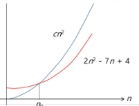
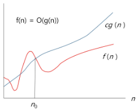
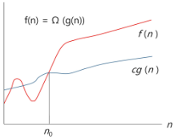
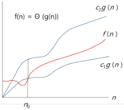

# Start
- SW 문제 해결
- 복잡도 분석
- 표준 입출력 방법
- 비트 연산
- 진수
- 실수


## 문제 해결 과정
1. 문제를 읽고 이해한다.
2. 문제를 익숙한 용어로 재정의한다.
3. 어떻게 해결할지 계획을 세운다
4. 계획을 검증한다.
5. 프로그램으로 구현한다.
6. 어떻게 풀었는지 돌아보고, 개선할 방법이 있는지 찾아본다.

---
## 복잡도 분석
-  복잡도의 점근적 표기
   - 시간 (또는 공간)복잡도는 입력 크기에 대한 함수로 표기하는데. 이 함수는 주로 여러 개의 항을 가지는 다항식이다.
   -  이를 단순한 함수로 표현하기 위해 점근적 표기 (Asymptotic Notation)를 사용한다.
   -  입력 크기 no 무한대로 커질 때의 복잡도를 간단히 표현하기 위해 사용하는 표기법이다.
    - O(Big-Oh) 표기
    - Ω(Big-Omega) 표기
    - Θ(Big-Theta) 표기

## O(Big-oh) 표기
- O표기는 복잡도의 **점근적 상한**을 나타낸다.
- 복잡도가 f(n) = 2n^2-7n+4 이라면, f(n)의 O 표기는 O(n^2)이다.
-  먼저 f(n)의 단순화된 표현은 n^2이다.
-  단순화된 함수 n^2에 임의의 상수 c를 곱한 **cn^2**이 n이 증가함에 따라 f(n)의 **상한**이 된다.
(단,c > 0)
- **단순히 실행시간이 n^2에 비례**하는 알고리즘이라고 말함



-  복잡도 f(n)과 O-표기를 그래프로 나타내고 있다.
-  n이 증가함에 따라 O(g(n))이 점근적 상한이라는 것 (즉, g(n)이 n0, 보다 큰 모든 n에 대해서 항상 f(n)보다 크다는 것)을 보여 준다.


## Ω(Big-Omega) 표기
-  복잡도의 **점근적 하한**을 의미한다.
- f(n) = 2n^2-7n+4 의 Ω 표기는 Ω(n^2)이다.
- f(n)=Ω(n^2)은 "n이 증가함에 따라 2n^2-7n+4이 cn^2보다 작을 수 없다"라는 의미이다.
이때 상수 c = 1로 놓으면 된다.
- O 표기 때와 마찬가지로, Ω 표기도 복잡도 다항식의 최고차항만 계수 없이 취하면 된다.
- **"최소한 이만한 시간은 걸린다"**

-  복잡도 f(n)과 Ω 표기를 그래프로 나타낸 것인데,. n이 증가함에 따라 Ω(g(n))이 점근적 하한이라는 것 (즉, g(n)이 n0,보다 큰 모든 n에 대해서 항상 f(n)보다 작다는 것)을 보여준다.


## Θ(Big-Theta) 표기
- O 표기와 Ω 표기가 같은 경우에 사용한다.
-f(n) = 2n^2+8n+3 = O(n^2) = Ω(n^2)이므로, f(n)=Θ(n^2)이다.
- "f(n)은 n이 증가함에 따라 **n^2과 동일한 증가율을 가진다**"라는 의미이다.



### 자주 사용하는 O - 표기

| 표기 | 내용 |
| --- | --- |
| O(1) | 상수 시간 (Constant time) |
| O(logn)  | 로그(대수) 시간 (Logarithmic time) |
| O(n) | 선형 시간 (Linear time) |
| O(nlogn)  | 로그 선형 시간 (log-linear time) |
| O(n^2) | 제곱 시간 (Quadratic time) |
| O(n^3) | 세제곱 시간 (cubic tima) |
| O(2^n) | 지수 시간 (Exponential time) |

---

## Python3 표준입출력
1. 입력
  - Raw 값의 입력 : `input()`
    - 받은 입력값을 문자열로 취급
  - Evaluated된 값 입력 : `eval(input())`
    - 받은 입력값을 평가된 데이터 형으로 취급

2. 출력
  - `print()`
    - 표준 출력 함수. 출력값의 마지막에 개행 문자 포함
  - `print ('text', end='')`
    - 출력 시 마지막에 개행문자 제외할 시
  - `print ('%d' %number)`
    - Formatting 된 출력

## 파일의 내용을 표준 입력으로 읽어오는 방법

> `import sys`
> `sys.stdin = open("a.txt". "r")`
```
import sys
sys-stdin = open("input.txt", "r") 
sys.stdout = open("output.txt", "w")
text = input()
print(text)
```

## tip
0으로 추가한 행과 열을 사방에 붙이고 싶을때
```
arr = [[0]*(M*2)+[[0]+list(map(int,input().split())) +[0] for _ in range(N)] + [0]*(M*2)]
```


## 비트 연산자
| 연산자 | 연산자의 기능 | 사용하는 곳 |
| -- | - | - |
| & | 비트단위로 AND 연산을 한다. (예) `num1 & num2` | 특정위치를 0으로 만들고 싶을때 -> 특정비트에만 0을 취함  |
| `\|` | 비트단위로 OR 연산을 한다. (예) `num1 \| num2` | 특정위치를 1으로 만들고 싶을때 -> 특정비트에만 1을 취함  |
| ^ | 비트단위로 XOR 연산을 한다. (같으면 0 다르면 1) (예) `num1 ^ num2` | 특정비트를 반전시키고 싶을때 -> 특정비트에만 1을 취함 |
| ~ | 단항 연산자로서 피연산자의 모든 비트를 반전시킨다. (예) ~num | 


| 연산자 | 연산자의 기능 |
| - | - |
| `num << 2` | 피연산자의 비트 열을 왼쪽으로 이동시킨다.  |
| `num >> 2` | 피연산자의 비트 열을 오른쪽으로 이동시킨다. |


- 1<<n
  - 2^n 의 값을 갖는다.
  - 원소가 n개일 경우의 모든 부분집합의 수를 의미한다.
  - Power set (모든 부분 집합)
    - 공집합과 자기 자신을 포함한 모든 부분집합
    - 각 원소가 포함되거나 포함되지 않는 2가지 경우의 수를 계산하면 모든 부분집합의 수가 계산된다.
- i&(1<<j)
  - 계산 결과는 i의 j번째 비트가 1인지 아닌지를 의미한다.

### 비트연산 예제1

```
def Bbit_print(i):
  output = ""
  for j in range(7, -1, -1):
    output += '1' if i & (i << j) else "0"
  print (output)

for i in range(-5, 6):
  print ("%3d = " % i, end = '')
  Bbit_print (i)
```
### 연습문제
-  0과 1로 이루어진 1차 배열에서 7개 byte를 묶어서 10진수로 출력하기
- 예를 들어
00000010001101
- 이면 1,13 을 출력한다.
- 입력 예
- 0000000111 1000000110 0000011110 0110000110 0001111001 1110011111 1001100111
- 편의상 10개 단위로 간격을 두었음. 이어있는 데이터로 간주하시오.

```
def Bbit_print(i):
    output = ''
    for j in range(7, -1, -1):
        output += "1" if i & (1 << j) else "0"
    print(output, end=' ')


a = 0x10  # 16
x = 0x01020304
print("%d = " % a, end='')
Bbit_print(a)
print()
"""
16 = 00010000
"""
output = ''
for j in range(31, -1, -1):
    output += "1" if x & (1 << j) else "0"
print(output)
"""
00000001000000100000001100000100 
"""
print("0%X = " % x, end='')
for i in range(0, 4):
    Bbit_print((x >> i * 8) & 0xff)
"""
01020304 = 00000100 00000011 00000010 00000001 -> 역순으로 찍어보기
"""
```
---
###  엔디안(Endianness)
   -  컴퓨터의 메모리와 같은 1차원의 공간에 여러 개의 연속된 대상을 배열하는 방법을 의미하며 HW 아키텍처마다 다르다.
   - 주의 : 속도 향상을 위해 바이트 단위와 워드 단위를 변환하여 연산 할 때 올바로 이해하지 않으면 오류를 발생 시킬 수 있다.

-  엔디안은 크게 두 가지로 나뉨
- 빅 엔디안(Big-endian)
  -  보통 큰 단위를 먼저 보냄 , 네트워크
- 리틀 엔디안(Little-endian)
  - 작은 단위를 먼저 보냄, 대다수 데스크탑 컴퓨터.

|종류|0x1234의 표현 | 0x12345678의 표현|
| - | - | - |
|빅엔디안 | 12 34 | 12 34 56 78 |
|리틀 엔디안 |  34 12 | 78 56 34 12 |


-  엔디안 확인 코드
```
import sys
print(sys.byteorder)
```
## 비트연산 예제 3, 4
```
def ce(n):  # n = 01 02 03 04
    p = []
    for i in range(0, 4):
        p.append((n >> (24 - i * 8)) & 0xff)
        # i가 0이면 오른쪽으로 24자리 옮겨서 맨 마지막값을 p에 추가해      -> [01]
        # i가 1이면 오른쪽으로 16자리 옮겨서 맨 마지막값을 p에 추가해      -> [01,02]
        # i가 2이면 오른쪽으로 8자리 옮겨서 맨 마지막값을 p에 추가해       -> [01,02,03]
        # i가 3이면 오른쪽으로 0자리 옮겨서 맨 마지막값을 p에 추가해       -> [01,02,03,04]
    return p


def ce1(n):
    # 바이트 단위로 역순으로 뽑아줌
    return (n << 24 & 0xff000000) | (n << 8 & 0xff0000) | (n >> 8 & 0xff00) | (n >> 24 & 0xff)

x = 0x01020304
p = []
for i in range(0, 4):
    p.append((x >> (i * 8)) & 0xff)  # x = 01 02 03 04
    # i가 0이면 오른쪽으로 0자리 옮겨서 맨 마지막값을 p에 추가해      -> [04]
    # i가 1이면 오른쪽으로 8자리 옮겨서 맨 마지막값을 p에 추가해      -> [04,03]
    # i가 2이면 오른쪽으로 16자리 옮겨서 맨 마지막값을 p에 추가해       -> [04,03,02]
    # i가 3이면 오른쪽으로 24자리 옮겨서 맨 마지막값을 p에 추가해       -> [04,03,02,01]

print('x = %02x%02x%02x%02x' % (p[0], p[1], p[2], p[3]))
p = ce(x)
print('x = %02x%02x%02x%02x' % (p[0], p[1], p[2], p[3]))
print(hex(ce1(x)))
"""
x = 04030201
x = 01020304
0x4030201
"""
```
### XOR 두번 연산하면 원래값을 반환한다
---
# 진수
## 2진수 8진수 10진수 16진수

-  10진수 > 타 진수로 변한
   -  원하는 타진법의 수로 나눈 뒤 나머지를 거꾸로 읽는다. -> 헷갈리면 십진수로 실행해보기
   - (예제) (149)10 = (10010101)2
= (225)8
= (95)16

-  타 진수 > 10진수로 변환
- (예) (135)8 = 1*8^2 + 3*8^1 + 5*8^0 = (93)10
-  소수점이 있을 때의 (예)
-(135.12)8 = 1*8^2 + 3*8^1 + 5*8^0 + 1*8^1 + 2*8^(-2)= (93.15625)10

### 이진수 코드
```
bit = [0]*8
a = 149
i = 7
# 자릿수를 알때
while a >0:
    bit[i] = a%2    # 해당 위치 bit에 할당
    a//=2
    i -= 1  # 자릿수를 하나씩 빼줌
bit[i] = a
print(''.join(map(str,bit)))    # 하나로 합쳐서 출력
```


### 컴퓨터에서의 음의 정수 표현 방법
- 1의 보수: 부호와 절대값으로 표현된 값을 부호 비트를 제외한 나머지 비트들을
0은 1로, 1은 0로 변환한다.
  - -6 : 1000000000000110 : 부호와 절대값 표현.
  - -6 : 1111111111111001 : 1의 보수 표현.
- 2의 보수 : 1의 보수방법으로 표현된 값의 최하위 비트에 1을 더한다.
  - -6 : 1111111111111010 : 2의 보수 표현
  - 그냥 더하면 계산이 됨 그리고 맨앞은 자릿수초과로 날라감
### 2의 보수 코드
```
def Bbit_print(i):
    output =""
    for j in range(7,-1,-1):
        output += "1" if i & (1<<j) else "0"
    print(output)

for i in range(-5,6):
    print("%3d = " %i, end = '')
    Bbit_print(i)
"""
 -5 = 11111011
 -4 = 11111100
 -3 = 11111101
 -2 = 11111110
 -1 = 11111111
  0 = 00000000
  1 = 00000001
  2 = 00000010
  3 = 00000011
  4 = 00000100
  5 = 00000101
  """
```
---
# 실수

- 소수점 이하 4자리를 10진수로 나타내보면


|2진수|10진수 값|
|-|-|
|0.0000|0|
|0.0001|0.0625|
|0.0010|0.125|
|0.0011|0.1875|
|0.0100|0.25|
|0.0101|0.3125|
|0.0110|0.375|
|0.0111|0.4375|
|0.1000|0.5|
|0.1001|0.5625|
|0.1010|0.625|
|0.1011|0.6875|
|0.1100|0.75|
|0.1101|0.8125|
|0.1110|0.875|
|0.1111|0.9375|


### 실수의 표현
   - 컴퓨터는 실수를 표현하기 위해 부동 소수점(Hloating-point) 표기법을 사용한다
   -  부동 소수점 표기 방법은 소수점의 위치를 고정시켜 표현하는 방식이다.
소수점의 위치를 왼쪽의 가장 유효한 숫자 다음으로 고정시키고 밑수의
지수승으로 표현
> 1001.0011 -> 1.0010011 * 2^3

### 실수를 저장하기 위한 형식
  - 단정도 실수(32비트)
  - 배정도 실수(64비트)
    - 가수부(mantissa):실수의 유효 자릿수들을 부호화된 고정소수점으로 표현한 것
    - 지수부(exponent) : 실제 소수점의 위치를 지수승으로 표현한것

### 단정도 실수의 가수 부분을 만드는 방법
- 예 : 1001.0011
  - 정수부의 첫번째 자리가 1이 되도록 오른쪽으로 시프트
  - 소수점 이하를 23비트로 만든다
  - 소수점 이하만을 다수 부분에 저장
  - 지수 부분은 시프트 한 자릿수만큼 증가 또는 감소

### 단정도 실수의 지수 부분을 만드는 방법
- 지수부에는 8비트가 배정(256개의 상태를 나타낼 수 있음)
- 숫자로는 0 - 255까지 나타낼 수 있지만, 음수 값을 나타낼 수 있어야 하므로 익세스 표현법을 사용
- 익세스 표현법 : 지수부의 값을 반으로 나누어 그 값을 0으로 간주하여 음수지수와 양수지수를 표현하는 방법

### 컴퓨터는 실수를 근사적으로 표현한다
- 이진법으로 표현할 수 없는 형태의 실수는 정확한 값이 아니라 근사 값으로 저장되는데 이때 생기는 작은 오차가 계산과정에서 다른 결과를 가져온다.

### 실수 자료형의 유효 자릿수
- 32비트 실수형 -> 6
- 64비트 실수형 -> 15